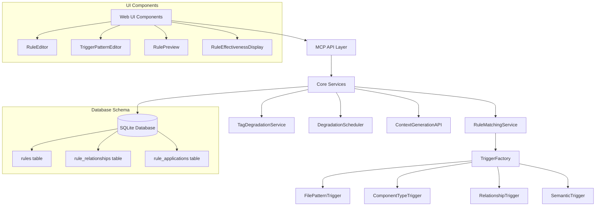

# Intelligent Rules System

The Intelligent Rules System provides context-aware rule matching that automatically suggests relevant coding rules, patterns, and best practices based on what developers are working on. Unlike static text files, this system leverages the existing search/indexing capabilities and entity linking to provide smart rule retrieval.

## Table of Contents

1. [Overview](#overview)
2. [Architecture](#architecture)
3. [Core Components](#core-components)
4. [Rule Types](#rule-types)
5. [Trigger System](#trigger-system)
6. [Context Integration](#context-integration)
7. [API Reference](#api-reference)
8. [User Guide](#user-guide)
9. [Developer Guide](#developer-guide)
10. [Performance Considerations](#performance-considerations)

## Overview

### Key Features

- **Context-Aware Matching**: Rules automatically appear based on file patterns, component types, business domains, and semantic context
- **Hierarchical Organization**: Support for parent-child rule relationships with inheritance
- **Multi-Entity Linking**: Rules can link to components, files, tasks, and other rules
- **Smart Triggers**: Multiple trigger types (file patterns, component types, relationships, semantic)
- **Conflict Detection**: Automatic detection and resolution of conflicting rules
- **Tag Degradation**: Automatic cleanup of outdated tags and rule relevance
- **Performance Optimization**: Caching, indexing, and efficient matching algorithms

### Benefits

- **Contextual Relevance**: Only see rules that apply to your current work
- **Reduced Cognitive Load**: No need to remember or search for relevant patterns
- **Consistency**: Ensure consistent application of coding standards across the team
- **Knowledge Sharing**: Capture and share domain-specific knowledge through semantic triggers
- **Maintenance**: Automatic cleanup and degradation of outdated rules

## Architecture



## Core Components

### RuleMatchingService

The central service responsible for finding applicable rules based on context.

```typescript
class RuleMatchingService {
  async findMatchingRules(
    entity: BaseComponent, 
    context: MatchingContext
  ): Promise<RuleMatch[]>
  
  async detectRuleConflicts(): Promise<RuleConflict[]>
  
  async applyRule(
    ruleId: string, 
    entityId: string, 
    context: ApplicationContext
  ): Promise<RuleApplication>
}
```

### TriggerFactory

Factory for creating different types of rule triggers using the Strategy pattern.

```typescript
class TriggerFactory {
  static createTrigger(type: TriggerType, config: TriggerConfig): ITrigger
}

interface ITrigger {
  matches(entity: BaseComponent, context: MatchingContext): boolean
  getConfidence(entity: BaseComponent, context: MatchingContext): number
}
```

### TagDegradationService

Manages automatic cleanup of outdated tags and rule relevance.

```typescript
class TagDegradationService {
  async runDegradation(): Promise<DegradationStats>
  async expireAutoTags(): Promise<number>
  async decayRuleRelevance(): Promise<number>
}
```

## Rule Types

### 1. Pattern Rules
Best practices and coding patterns for specific file types or components.

```typescript
{
  rule_type: 'pattern',
  guidance_text: 'Use React.memo for expensive components',
  trigger_patterns: {
    files: ['**/*.tsx'],
    components: ['component']
  }
}
```

### 2. Constraint Rules
Constraints and limitations that should be enforced.

```typescript
{
  rule_type: 'constraint',
  guidance_text: 'Components should not exceed 200 lines',
  context_conditions: {
    file_size: { max: 200 }
  }
}
```

### 3. Semantic Rules
Domain-specific rules that trigger based on business context.

```typescript
{
  rule_type: 'semantic',
  guidance_text: 'Authentication components must validate inputs',
  semantic_triggers: {
    business_domains: ['authentication'],
    patterns: ['login', 'auth', 'token']
  }
}
```

### 4. Automation Rules
Rules that can generate code templates or perform automated actions.

```typescript
{
  rule_type: 'automation',
  guidance_text: 'Auto-generate error handling wrapper',
  code_template: 'try { ${code} } catch (error) { handleError(error); }',
  auto_apply: true
}
```

## Trigger System

### File Pattern Triggers

Match based on file paths and glob patterns:

```typescript
{
  trigger_patterns: {
    files: [
      '**/*.tsx',           // React components
      '**/auth/**/*.ts',    // Authentication files
      'src/components/**/*' // Component directory
    ]
  }
}
```

### Component Type Triggers

Match based on component types:

```typescript
{
  trigger_patterns: {
    components: ['component', 'service', 'hook', 'utility']
  }
}
```

### Relationship Triggers

Match based on component relationships:

```typescript
{
  trigger_patterns: {
    relationships: ['depends_on', 'imports'],
    minCount: 3  // Trigger when component has 3+ dependencies
  }
}
```

### Semantic Triggers

Match based on business context and content:

```typescript
{
  semantic_triggers: {
    business_domains: ['authentication', 'payment', 'user-management'],
    patterns: ['login', 'secure', 'validate', 'encrypt'],
    architectural_layers: ['frontend', 'backend', 'data']
  }
}
```

### Context Conditions

Apply additional constraints based on file metrics:

```typescript
{
  context_conditions: {
    file_size: { min: 100, max: 1000 },
    complexity: { max: 15 },
    dependencies: { max: 10 }
  }
}
```

## Context Integration

### Automatic Rule Inclusion

Rules are automatically included in context generation:

```typescript
const context = await contextAPI.generateContext(componentId, {
  includeRules: true,
  user_intent: 'implementing authentication',
  target_token_size: 8000
});

// context.applicableRules contains matched rules
```

### Confidence Scoring

Each rule match includes a confidence score:

```typescript
interface RuleMatch {
  rule: Rule;
  confidence: number;      // 0.0 - 1.0
  triggerTypes: string[];  // Which triggers matched
  metadata: {
    matchedPatterns: string[];
    semanticRelevance: number;
    contextAlignment: number;
  };
}
```

### Conflict Resolution

Rules are automatically ordered by:
1. Priority (1-10, higher first)
2. Confidence score
3. Specificity of triggers
4. Last application time

## API Reference

### MCP Tool: `rules`

#### Add Rule
```typescript
{
  action: 'add',
  name: 'Rule Name',
  description: 'Rule description',
  rule_type: 'pattern' | 'constraint' | 'semantic' | 'automation',
  guidance_text: 'Detailed guidance',
  priority: 1-10,
  trigger_patterns?: TriggerPatterns,
  semantic_triggers?: SemanticTriggers,
  context_conditions?: ContextConditions
}
```

#### Get Applicable Rules
```typescript
{
  action: 'get_applicable',
  entity_type: 'component' | 'file' | 'project',
  entity_id: 'component-id',
  context?: {
    user_intent?: string,
    business_domain?: string,
    file_content?: string
  },
  confidence_threshold?: number
}
```

#### List Rules
```typescript
{
  action: 'list',
  rule_type_filter?: 'pattern' | 'constraint' | 'semantic' | 'automation',
  active_only?: boolean,
  limit?: number
}
```

### Degradation Tool: `degradation`

#### Get Status
```typescript
{
  action: 'status'
}
```

#### Run Cleanup
```typescript
{
  action: 'run_cleanup',
  force?: boolean
}
```

#### Configure
```typescript
{
  action: 'configure',
  config: {
    autoTagMaxAge?: number,
    contextualTagMaxAge?: number,
    ruleDecayRate?: number
  }
}
```

## User Guide

### Creating Smart Rules

1. **Define Basic Information**
   - Name: Clear, descriptive name
   - Type: Choose appropriate rule type
   - Priority: 1-10 (higher = more important)
   - Guidance: Detailed, actionable guidance

2. **Configure Triggers**
   - File Patterns: Use glob patterns for file matching
   - Component Types: Select relevant component types
   - Semantic Triggers: Define business domains and patterns
   - Context Conditions: Set file size/complexity constraints

3. **Test and Preview**
   - Use Rule Preview to test against existing components
   - Check confidence scores and match counts
   - Refine triggers based on results

### Managing Rule Hierarchy

- **Parent Rules**: General guidelines that apply broadly
- **Child Rules**: Specific overrides or extensions
- **Inheritance**: Child rules inherit parent triggers unless overridden

### Analytics and Monitoring

- **Usage Tracking**: Monitor which rules are applied most frequently
- **Acceptance Rates**: Track how often suggested rules are accepted
- **Effectiveness Scores**: Measure rule value based on user feedback
- **Conflict Detection**: Identify and resolve conflicting rules

## Developer Guide

### Extending Trigger Types

Create new trigger types by implementing the `ITrigger` interface:

```typescript
class CustomTrigger implements ITrigger {
  constructor(private config: CustomTriggerConfig) {}
  
  matches(entity: BaseComponent, context: MatchingContext): boolean {
    // Custom matching logic
  }
  
  getConfidence(entity: BaseComponent, context: MatchingContext): number {
    // Confidence calculation
  }
}

// Register with factory
TriggerFactory.registerTrigger('custom', CustomTrigger);
```

### Custom Rule Processing

Extend rule processing with custom handlers:

```typescript
class CustomRuleProcessor {
  async processRule(rule: Rule, entity: BaseComponent): Promise<ProcessingResult> {
    // Custom processing logic
  }
}

// Register processor
RuleMatchingService.registerProcessor('custom', new CustomRuleProcessor());
```

### Performance Optimization

1. **Caching Strategy**
   - Rule matching results are cached by entity + context hash
   - Cache invalidation on rule or entity changes
   - LRU eviction with configurable size limits

2. **Database Indexing**
   - Indexes on rule type, priority, active status
   - Composite indexes for common query patterns
   - Partial indexes for trigger pattern queries

3. **Batch Processing**
   - Bulk rule matching for multiple entities
   - Batch rule application with transaction support
   - Parallel processing for independent operations

### Testing

Run the comprehensive test suite:

```bash
# Unit tests
npm run test

# Integration tests
npm run test:integration

# Performance tests
npm run test:performance

# Coverage report
npm run test:coverage
```

## Performance Considerations

### Scalability

- **Rule Matching**: O(n) complexity where n = number of active rules
- **Caching**: Reduces repeated matching operations by 80-90%
- **Indexing**: Database queries optimized with proper indexes
- **Batching**: Process multiple entities efficiently

### Memory Usage

- **Rule Cache**: LRU cache with 1000 entry limit (configurable)
- **Trigger Objects**: Lazy instantiation and pooling
- **Context Data**: Cleaned up after processing

### Optimization Strategies

1. **Early Termination**: Stop matching when confidence threshold reached
2. **Filter Optimization**: Apply cheapest filters first
3. **Parallel Processing**: Match multiple entities concurrently
4. **Smart Invalidation**: Only invalidate relevant cache entries

### Monitoring

Track performance metrics:
- Rule matching latency (target: <100ms)
- Cache hit rates (target: >80%)
- Database query performance
- Memory usage patterns

For detailed API documentation, see [API_REFERENCE.md](./API_REFERENCE.md).
For development setup, see [DEVELOPMENT.md](./DEVELOPMENT.md).
For troubleshooting, see [TROUBLESHOOTING.md](./TROUBLESHOOTING.md).