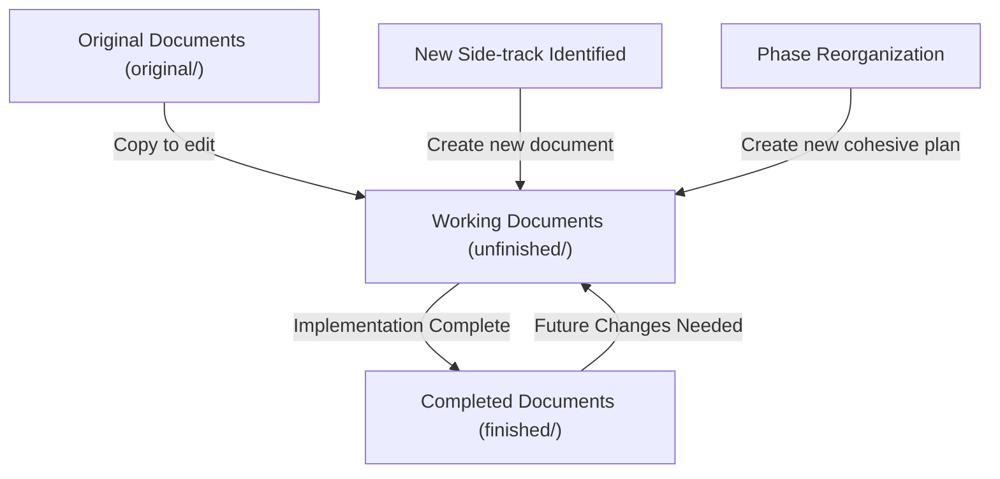
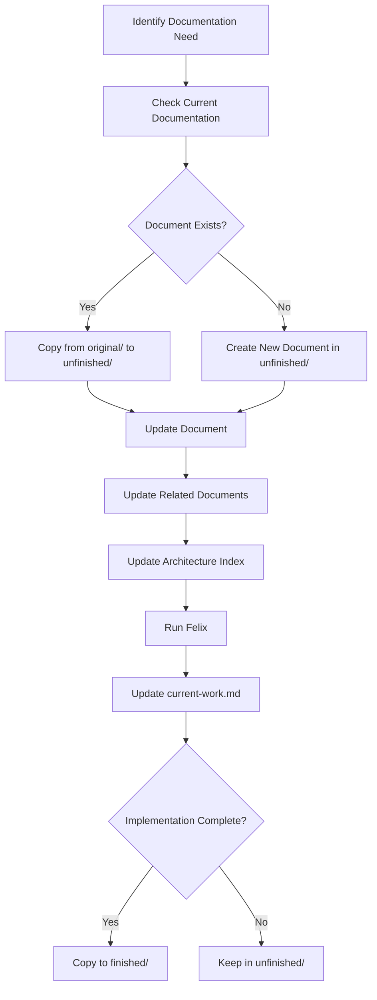
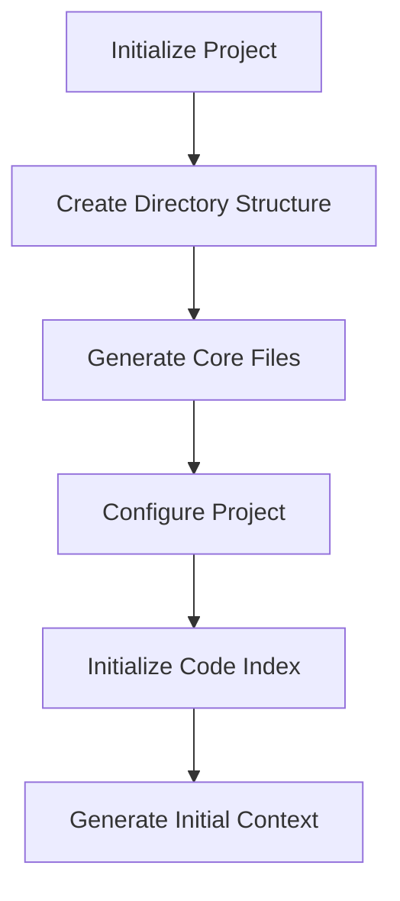
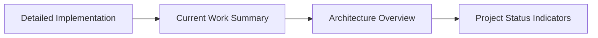
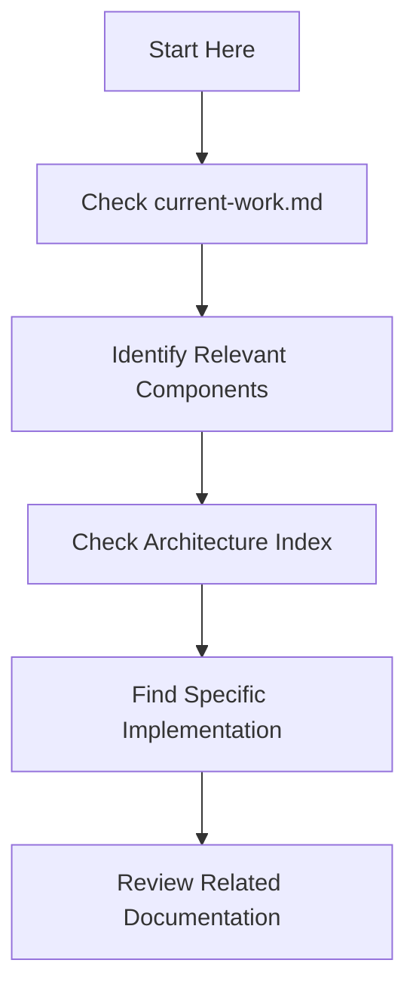

# 📚 Self-Documenting System

## 🔍 Overview

This system helps AIgent Smith maintain context between sessions by providing a structured approach to documentation, code navigation, and context preservation. It ensures that both humans and AI assistants can efficiently understand and work with the codebase through integrated architecture indexing, code indexing, and documentation standards.

> ⚠️ **IMPORTANT**: For automated testing practices that extend this self-documenting workflow, see [Automated Test Writing and Running](./002-automated-test-writing-and-running.md) documentation.
> 
> For AI-optimized documentation patterns and reference indexing system, see [AI-Optimized Documentation Index System](./006-ai-optimized-documentation-index-system.md).

## 📋 Status Indicators

| Icon | Meaning | Usage |
|------|---------|-------|
| 🔄 | In Progress | Work actively being done |
| ✅ | Complete | Fully implemented and tested |
| ⏳ | Planned | Scheduled for future implementation |
| 🧪 | Needs Testing | Implementation complete but requires validation |
| 🐛 | Has Issues | Known problems that need addressing |
| 📝 | Needs Documentation | Code exists but lacks proper documentation |

## 📁 Documentation Organization

### ⚠️ CRITICAL FOLDER STRUCTURE AND NAMING CONVENTIONS ⚠️

The AIgent Smith documentation follows a strictly defined structure that must be maintained:

#### System Documentation Files (NEVER MOVE)

The System Documentation files are **CRITICAL** and must NEVER be moved from their root location:

- **Root `docs/` Directory System Files**:
  - `000-framework-overview.md` - Framework fundamentals
  - `001-self-documenting-system.md` - This documentation system description
  - `002-automated-test-writing-and-running.md` - Testing documentation
  - `003-project-plan-to-code-process.md` - Code process documentation
  
  > 🚫 **CRITICAL WARNING**: These system files must NEVER be moved, renamed, or relocated into subdirectories. They are the foundation of the system and must remain at the docs/ root level.

#### Chronological Structure

All documentation follows a chronological organization pattern using numerical prefixes:

- **Root `docs/` Files**: Numbered sequentially (`00-`, `01-`, etc.) to show order of introduction
- **Project Phases**: Properly prefixed files in the project-phases directory
- **Three-Folder Structure**: `original/`, `unfinished/`, and `finished/` track document status

#### Project Phase Documentation Structure

The `docs/project-phases/` directory contains three subdirectories that track document status:

1. **`original/`**: Contains original documentation that should NEVER be modified
   - Preserves the baseline documentation that establishes core concepts
   - Maintains historical record of initial design decisions
   - Files can be copied to unfinished/ for updates, but originals must be preserved

2. **`unfinished/`**: Contains documentation for ongoing work and active development
   - Houses specifications for features being actively implemented
   - Updated regularly with new developments and changes
   - Serves as the current working documentation for in-progress features

3. **`finished/`**: Contains completed documentation for implemented features
   - Houses final documentation for completed features
   - Includes comprehensive details on implemented components
   - Serves as reference material for future development

#### Proper Project Phase Naming

Project phase documents follow strict naming conventions:

1. **True Phase Documents** (01-05): Represent core project phases
   - `01-phase-1-core-infrastructure.md`
   - `02-phase-2-basic-functionality.md`
   - `03-phase-3-advanced-features.md`
   - `04-phase-4-refinement.md`
   - `05-phase-5-integration-deployment.md`

2. **Side-track Documents** (06+): Represent unplanned deviations from original phases
   - Start with numerical prefix (e.g., `06-sqlite-storage-system.md`)
   - Document work that was NOT part of the original project plan
   - MUST NOT use "phase-" in the name as they are not planned phases
   - Numbered chronologically by when the side-track was started
   
3. **Important Distinction - Side-tracks vs. Features**:
   - Side-tracks are NOT simply "feature implementations" within planned phases
   - They represent work that diverted from the original complete project plan
   - Before any code was written, we had a complete cohesive plan for phases 1-5
   - Any work not originally planned is a side-track, not a planned feature
   - Proper naming helps distinguish between planned work (phases) and unplanned diversions
   - When many side-tracks accumulate, we should reorganize and create a new cohesive plan

### Documentation Categories

The documentation system is organized into several key sections:

1. **Architecture Documentation** [✅ Complete]
   - `docs/00-system-architecture.md` - Main architecture index
   - `docs/06-unified-architecture-plan.md` - Detailed architectural design
   - `docs/project-phases/` - Implementation phases and details

2. **Current Work Tracking** [✅ Complete]
   - `current-work.md` - Current status, priorities, and next steps

3. **Framework Documentation** [✅ Complete]
   - `prompting-framework/init.md` - Initialization sequence
   - `prompting-framework/claude-code/` - Claude-specific instructions

4. **Tool Documentation** [✅ Complete]
   - `docs/tools/` - Documentation for specific tools
   - `tools/mcp/` - MCP command implementations

5. **Code Indexing** [✅ Complete]
   - `.aigent-smith/.code-index.db` - SQLite database for code index
   - `docs/tools/felix/format.md` - Format documentation
   - `tools/felix/` - Code indexer implementation

## 🔖 Reference Format System

### Documentation References [✅ Complete]

All documentation follows these reference formats:

| Reference Type | Format | Example | Purpose |
|----------------|--------|---------|---------|
| **File References** | `path/from/root` | `docs/00-system-architecture.md` | Navigate to files |
| **Line References** | `file:line-range` | `tools/mcp/mcp__smith.js:120-150` | Precise code location |
| **Component References** | `C#:NAME` | `C1:AGENT_SYSTEM` | Architecture components |
| **Implementation References** | `I#:NAME` | `I1:CLAUDE_CODE_AGENT` | Implementation details |
| **Cross-Document References** | `→ See file:line` | `→ See docs/00-system-architecture.md:100-120` | Related documentation |

### Felix References [✅ Complete]

The code indexer uses these reference formats for code navigation:

| Reference Type | Format | Example | Purpose |
|----------------|--------|---------|---------|
| **File References** | `F#:path` | `F1:/path/to/file.js` | Track source files |
| **System References** | `S#:NAME\|Description\|` | `S1:SYSTEM_NAME\|Description\|` | Major systems |
| **Code Snippet References** | `CS#:NAME\|Description\|` | `CS1:SNIPPET_NAME\|Description\|` | Important code sections |
| **Line References** | `F#>line-range:Description` | `F1>10-20:Component description` | Specific code ranges |
| **Context Links** | `CL#:NAME\|Description\|` | `CL1:CONCEPT_NAME\|Description\|` | Related concepts |
| **Documentation Sections** | `DS#:NAME\|Description\|` | `DS1:SECTION_NAME\|Description\|` | Documentation sections |

## 🔄 Document Update Process

### When to Update Documentation

Documentation should be updated in the following scenarios:
1. When implementing new features
2. When fixing bugs that change behavior
3. When refactoring code that affects architecture
4. When changing APIs or interfaces
5. When completing a phase or milestone
6. When side-tracks accumulate and require reorganization

### Three-Folder Document Workflow

The process of updating documents follows a specific workflow through the three-folder structure:



#### Document Progression Steps:

1. **Starting Point - Original Documents**:
   - Files in `original/` are NEVER modified directly
   - They preserve the initial project plan and documentation
   - Original documents serve as the complete reference implementation plan

2. **Document Splitting Process**:
   - Examine implementation status using current-work.md and current-work-logs
   - Create complementary split versions of the document:
     - `finished/` - contains only completed portions
     - `unfinished/` - contains only in-progress/planned portions
   - Both maintain the exact same structure as the original
   - When merged, these files should recreate the original document exactly

3. **Finished Document Guidelines**:
   - Extract ONLY the completed portions from the original document
   - Maintain EXACT wording and structure as the original
   - Include section headings for organization, even for incomplete sections
   - Mark incomplete sections with "⏳ Not Yet Implemented" or similar
   - Do NOT include implementation plans for unfinished work

4. **Unfinished Document Guidelines**:
   - Extract ONLY the in-progress or planned portions from the original document
   - Maintain EXACT wording and structure as the original
   - Include section headings for organization, even for completed sections
   - Mark completed sections with "✅ Complete" and reference to finished document
   - Keep all planning details for unfinished work

5. **Verification Process**:
   - Verify that combining the unfinished + finished = original document
   - Use diff tools to check for complete coverage
   - Ensure no content from original document is missing from either version
   - Make adjustments if needed to maintain perfect complementary structure

6. **Handling Side-tracks**:
   - Side-tracks follow the same splitting process
   - Assign appropriate numerical prefix (next available)
   - NEVER use "phase-" in name unless a true phase
   - Create both finished and unfinished versions as appropriate

7. **Reintegration of Side-tracks**:
   - When many side-tracks accumulate, pause development
   - Create a cohesive plan integrating all side-tracks
   - Update architecture index with comprehensive view
   - Document relationships between side-tracks and phases


### Process for Updating Documentation



#### Steps for Documentation Updates:

1. **Identify Affected Systems**:
   - List all components affected by changes
   - Note which documentation files need updates
   - Determine if change affects original plan or is a side-track

2. **Update Documentation in Correct Location**:
   - Copy original documents to `unfinished/` for editing
   - For side-tracks: Create new documents in `unfinished/` with proper numerical prefix
   - Never modify files in `original/` directly
   - Ensure all status indicators are accurate

3. **Maintain Document Structure**:
   - Keep the skeleton of original document structure
   - Clearly mark additions and changes
   - Minimize duplication while preserving original structure
   - For side-tracks, document relationship to original plan

4. **Cross-Reference Updates**:
   - Update related documents with cross-references
   - Maintain consistent reference formats
   - Document relationships between side-tracks and phases

5. **Architecture Index Updates**:
   - Update component definitions if needed
   - Add new components/patterns as required
   - Ensure focus areas reflect current work
   - Document how side-tracks integrate with main architecture

6. **Complete Documentation Lifecycle**:
   - When implementation is complete, copy to `finished/`
   - Update status in current-work.md
   - Keep original documents unchanged for historical reference
   - Document lessons learned from side-tracks

## 🏗️ Integrated Index System [✅ Complete]

The AIgent Smith index system consists of two integrated components:

### Architecture Index
High-level system architecture (in `docs/00-system-architecture.md`)

| Category | Format | Purpose | Examples |
|----------|--------|---------|----------|
| **Components** | C1-C8 | Major system components | `C1:AGENT_SYSTEM`, `C3:TOOL_SYSTEM` |
| **Design Patterns** | DP1-DP10 | Common patterns used | `DP1:ADAPTER_PATTERN`, `DP5:DECORATOR_PATTERN` |
| **Implementations** | I1-I5 | Specific approaches | `I1:CLAUDE_CODE_AGENT`, `I2:AIGENT_SMITH_AGENT` |
| **Documents** | D1-D10 | Key documentation | `D1:SYSTEM_ARCHITECTURE`, `D3:FELIX` |

### Code Index
Detailed code-level index (in `.aigent-smith/.code-index.db`)

| Category | Format | Purpose | Examples |
|----------|--------|---------|----------|
| **Files** | F1-Fn | Tracked files | `F1:/src/agents/ClaudeCodeAgent.js` |
| **Systems** | S1-Sn | Application systems | `S1:AGENT_SYSTEM\|Agent abstraction layer\|` |
| **Code Snippets** | CS1-CSn | Code sections | `CS1:AGENT_INTERFACE\|Agent interface definition\|` |
| **Documentation** | DS1-DSn | Doc sections | `DS1:AGENT_WORKFLOW\|Agent processing pipeline\|` |
| **Context Links** | CL1-CLn | Cross-references | `CL1:MODEL_AGENT\|Connection between models and agents\|` |

### Index Query Operations [✅ Complete]

The code indexer supports these query operations:

| Operation | Purpose | Example | Result |
|-----------|---------|---------|--------|
| **EXPAND** | Get referenced content | `EXPAND CS1` | Shows code snippet CS1 |
| **CONTEXT** | Find related entries | `CONTEXT S2` | Lists all components related to S2 |
| **DEEP_EXPAND** | Recursive expansion | `DEEP_EXPAND CL1` | Expands all related components |
| **FIND_REFS** | Locate references | `FIND_REFS F1>50` | Finds all references to line 50 in F1 |

## 🛠️ MCP Command System

MCP (Model-Codebase-Project) commands are specialized functions that provide AI assistants with enhanced capabilities for interacting with the project. They're located in the `tools/mcp/` directory.

### Available MCP Commands [✅ Complete]

| Command | Purpose | Key Functions | Example |
|---------|---------|--------------|---------|
| **`mcp__smith.js`** | Main interface | `init`, `search`, `index`, `note`, `context`, `help` | `mcp__smith init` |
| **`mcp__init_framework.js`** | Project setup | Directory setup, file generation, configuration | `mcp__init_framework new-project` |
| **`mcp__code_indexer.js`** | Code indexing | Parse code, index components, query codebase | `mcp__code_indexer create /path/to/project` |
| **`mcp__context.js`** | Context generation | Generate AI context from code index | `mcp__context --componentId=C1` |
| **`mcp__note.js`** | Note management | Create, tag, search notes on components | `mcp__note add "Needs refactoring" --componentId=C3` |
| **`mcp__update_architecture_index.js`** | Architecture management | Update architecture index | `mcp__update_architecture_index` |

### Project Initialization Process [✅ Complete]

The project initialization process (via `mcp__init_framework.js`) follows these steps:



1. **Directory Structure Creation**:
   - Creates `.aigent-smith/` directory for project-specific data
   - Sets up `docs/` directory with required documentation
   - Copies `prompting-framework/` for AI initialization

2. **File Generation**:
   - Creates `CLAUDE.md` with critical instruction box
   - Sets up `current-work.md` for tracking project status
   - Initializes `docs/00-system-architecture.md` with architecture index template

3. **Configuration**:
   - Creates configuration files in `.aigent-smith/`
   - Sets up template resolution for project-specific customization
   - Detects if running within AIgent Smith or an external project

4. **Code Indexing** (Optional):
   - Initializes the code index database (.aigent-smith/.code-index.db)
   - Performs initial code parsing and indexing
   - Generates AI-friendly context from the indexed code

## 📊 Felix System [✅ Complete]

The code indexer system provides efficient navigation of the codebase for AI assistants:

### Storage Architecture [✅ Complete]

The indexer uses a hybrid approach for optimal performance:

| Storage Type | Location | Purpose | Characteristics |
|--------------|----------|---------|----------------|
| **SQLite Database** | `.aigent-smith/.code-index.db` | Store metadata and relationships | Fast queries, structured data |
| **Specialized Files** | Generated on demand | AI-optimized context | Context window efficiency |

### Indexing Components [✅ Complete]

The code indexer analyzes and tracks these elements:

| Component Type | Reference Format | Purpose | Contents |
|----------------|------------------|---------|----------|
| **Files** | F1, F2, etc. | Track source files | File paths, modification times |
| **Components** | C1-C8 | Code elements | Classes, functions, description |
| **Systems** | S1, S2, etc. | Application systems | Related components, purpose |
| **Interfaces** | I1, I2, etc. | Component interactions | Method definitions, parameters |
| **Documentation** | DS1, DS2, etc. | Structured docs | Documentation text, related code |
| **Context** | CL1, CL2, etc. | Relationship links | Connected components, relationship type |

### Integration with Architecture Index [✅ Complete]

The code indexer complements the architecture index:

1. **Architecture Index**: High-level component documentation
   - Components (C1-C8): Major system elements
   - Design Patterns (DP1-DP10): Reusable design approaches
   - Focus Areas (CF1-CF4): Current development priorities

2. **Code Index**: Detailed code-level references
   - Provides actual implementations of architecture components
   - Links documentation to specific code locations
   - Supports precise navigation to implementation details

3. **Cross-Referencing**: Bridges architecture and code
   - Architecture component C1 links to code snippets CS1, CS2
   - Code system S1 implements architecture component C3
   - Documentation section DS1 explains design pattern DP2

## 📝 Notes System [✅ Complete]

The notes system allows attaching context to code components:

| Feature | Purpose | Implementation |
|---------|---------|----------------|
| **Note Creation** | Link notes to components | Manual/automatic tagging |
| **Component Discovery** | Find components for notes | Search by name/function |
| **Note Queries** | Find context-specific notes | Component/content search |
| **Integration** | Include notes in context | Automatic inclusion in generated context |

## 📋 Progressive Summarization System

The documentation system uses progressive summarization to maintain concise current state while preserving historical details:



### Levels of Summarization:

1. **Raw Implementation Details**: Complete implementation logs
   - Located in: Individual component documentation
   - Purpose: Detailed implementation records

2. **Current Work Summary**: Condensed version of active work
   - Located in: `current-work.md`
   - Purpose: Track current priorities and status

3. **Architecture Overview**: System structure and relationships
   - Located in: `docs/00-system-architecture.md`
   - Purpose: Provide high-level navigation

4. **Project Status Indicators**: At-a-glance progress view
   - Located in: Status tables in `current-work.md`
   - Purpose: Quick assessment of completion status

### Summarization Process:

1. **Complete Implementation** → Create detailed docs with full implementation details
2. **Milestone Reached** → Summarize into current-work.md with key points
3. **Phase Completion** → Update architecture index with new components/patterns
4. **Project Status Update** → Update status indicators in current-work.md

## 🧩 Usage Guidelines

### Document Navigation Workflow



### Best Practices

| Practice | Description | Example |
|----------|-------------|---------|
| **Start with Current Work** | Begin with `current-work.md` | Check current focus areas first |
| **Follow Architecture Index** | Use component IDs | Navigate from C1:AGENT_SYSTEM to implementations |
| **Maintain Documentation** | Update alongside code | Document before coding, update after |
| **Use Precise References** | Always use file:line format | `src/agents/ClaudeCodeAgent.js:120-150` |
| **Track Status** | Use consistent indicators | 🔄✅⏳🧪🐛📝 |
| **Compress Context** | Focus on immediate work | Prioritize current focus areas in summaries |
| **Check Architecture** | Review system structure | Refer to `docs/00-system-architecture.md` |
| **Query Code Index** | Use index operations | EXPAND, CONTEXT, DEEP_EXPAND, FIND_REFS |
| **Link Components** | Maintain cross-references | Connect architecture with implementation |
| **Add Notes** | Attach context to components | Document rationale and decisions |

## 🔍 Examples: Using the Integrated System

### Example 1: Finding Implementation of Architecture Component

1. Start with architecture index to find component description:
   ```
   C3:TOOL_SYSTEM - Tool registry and execution framework
   ```

2. Use code index to find implementations:
   ```
   CONTEXT C3
   ```

3. Expand code snippets to see actual implementation:
   ```
   EXPAND CS12
   ```

### Example 2: Understanding a System Feature

1. Use natural language query to find relevant components:
   ```
   mcp__context "How does the permission system work?"
   ```

2. Examine returned components and their relationships:
   ```
   S5:PERMISSION_SYSTEM|Tool permission management|
   F12>150-200:Permission classes
   F13>50-120:Permission validation logic
   ```

3. View documentation on the feature:
   ```
   EXPAND DS8
   ```

### Example 3: Updating Documentation for Multiple Systems

1. Identify all affected systems:
   ```
   FIND_REFS "permission system"
   ```

2. Update primary documentation:
   - Update `docs/tools/tool-permission-system.md`
   - Add new sections describing changes

3. Update related documents:
   - Update cross-references in `docs/00-system-architecture.md`
   - Update implementation details in specific component docs

4. Update architecture index:
   - Run `mcp__update_architecture_index`
   - Verify new components/patterns are included

5. Update current-work.md:
   - Update status for related tasks
   - Update completion percentages

6. Run code indexer:
   - `mcp__code_indexer update`
   - Verify new references are correctly indexed

_This file is maintained by AIgent Smith to track documentation standards._