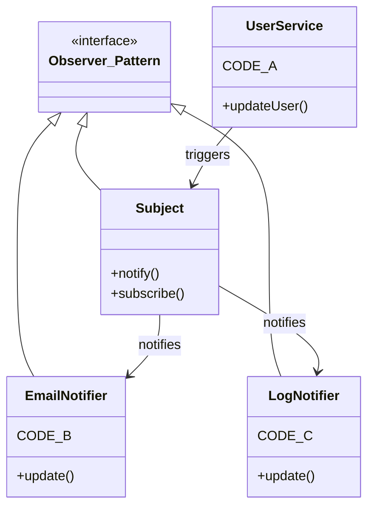
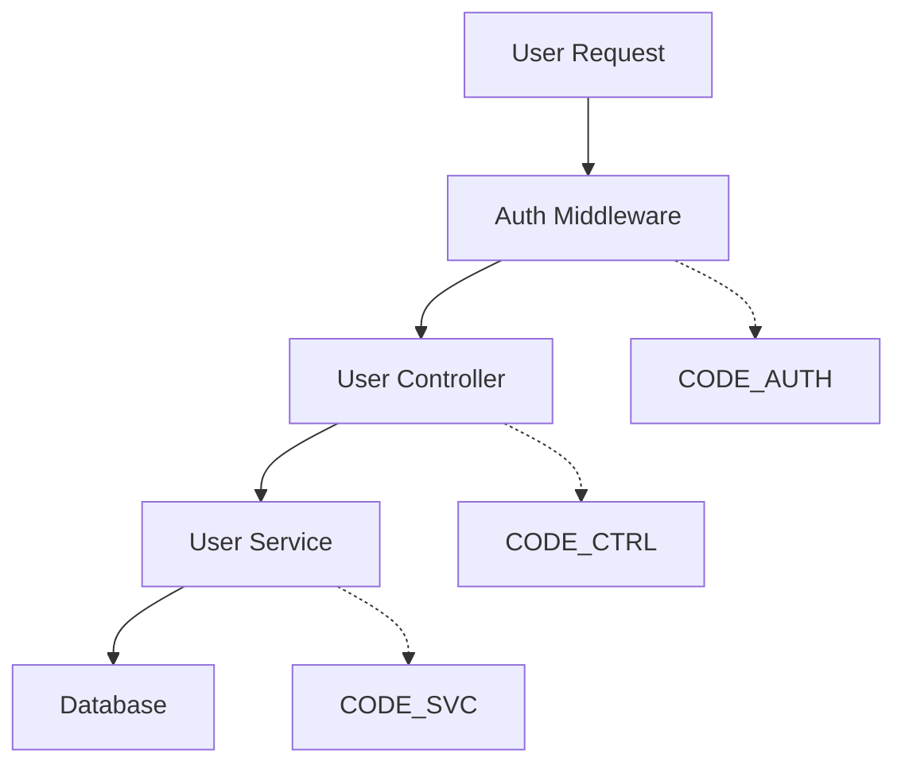

# AI Code Compression Language (AICCL) - Design Specification

## Core Concept

The AI Code Compression Language exploits AI models' existing cross-language programming knowledge to create ultra-compressed code representations that can be expanded through simple prompting - no specialized tools required.

**Key Insight**: AI models already understand programming concepts across languages. Instead of building expansion tools, we design a compression format that AI can intuitively interpret and expand on demand.

## The Assembly Language Analogy

Just as assembly language optimizes for machine execution speed, AICCL optimizes for AI token efficiency. It serves as a "bytecode for AI communication" - human-unreadable but AI-interpretable.

## Why This Works

### AI's Existing Knowledge
- AI models are trained on code across hundreds of programming languages
- They understand that all programming languages are abstractions over similar concepts
- They can recognize patterns and infer meaning from context
- They don't need explicit training on new syntax - they can deduce it

### No Teaching Required
The AI doesn't need to be "taught" the compression language. Instead:
- Provide a simple mapping reference
- Use intuitive symbols that align with programming concepts
- Let the AI's pattern recognition handle the rest
- Expansion happens through natural language prompting

## Language Design Principles

### Ultra-Minimization
Every character serves a semantic purpose. The goal is maximum information density per token while maintaining AI interpretability.

### Intuitive Symbols
Use symbols that naturally map to programming concepts:
```
M: = Model (maps to class/struct/entity concepts)
F: = Function (universal programming concept)  
{} = Container notation (familiar from JSON/objects)
() = Parameters (universal function syntax)
:  = Type annotation (common across languages)
>  = Flow/pipeline (intuitive directional operator)
```

### Hierarchical Structure
Support nested compression through multiple map levels that build on each other.

## Compression Format Specification

### Basic Structure
```xml
<comp:map>
  // Define compression mappings
</comp:map>

<comp:code>
  // Ultra-compressed code using mappings
</comp:code>
```

### Map Definition Syntax

#### Core Elements
```
M: = Model/Entity definition
F: = Function definition
C: = Class definition
I: = Interface definition
```

#### Containers
```
{} = Field/property container
() = Parameter container
<> = Generic/template container
[] = Array/collection indicator
```

#### Type System
```
:s = string
:i = integer  
:b = boolean
:d = date
:a = array
:o = object
# = hashed/encrypted
? = optional field
! = required field
```

#### Operations
```
q> = query/read operation
s> = save/write operation  
d> = delete operation
v> = validate operation
t> = transform operation
f> = filter operation
>> = pipeline flow
```

### Compression Strategies

#### Pattern Abstraction
Instead of writing full CRUD operations:
```
F:gU(i){q>D:U.f(i)>r}  // Get user function
F:cU(d){v>s>D:U.a(d)}  // Create user function
```

#### Semantic Shortcuts
```
{n,e,p#} = {name:string, email:string, password:hashed}
```

#### Reference Systems
```
D: = Database
U = User model
R{} = REST endpoint definitions
```

## Usage Examples

### Basic Model Definition
```xml
<comp:map>
  M: = Model with fields:
  U = User
  {n,e,p#} = {name:string, email:string, password:hashed}
  F: = function
  q> = query database
  v> = validate input
  s> = save to database
  r = return result
</comp:map>

<comp:code>
  M:U{n,e,p#}
  F:gU(i){q>D:U.f(i)>r}
  F:cU(d){v>s>D:U.a(d)}
</comp:code>
```

**Expansion Prompt**: "Turn to PHP 8.1 code: [above format]"

### Complex System Architecture
```xml
<comp:map>
  MS = Microservice
  API = REST endpoints
  MQ = Message queue
  DB = Database
  AUTH = Authentication middleware
</comp:map>

<comp:code>
  MS:USER{AUTH>API:/users>DB:users}
  MS:ORDER{API:/orders>MQ:payment_events>DB:orders}
  MS:PAYMENT{MQ:listen>API:stripe>DB:transactions}
</comp:code>
```

### Algorithm Compression
```xml
<comp:map>
  ALG = Algorithm
  SORT = Sorting operation
  TREE = Binary tree
  SEARCH = Search operation
</comp:map>

<comp:code>
  ALG:SORT:merge(arr){divide>conquer>merge}
  ALG:TREE:SEARCH(val,node){compare>recurse_left|right>return}
</comp:code>
```

## Two-Shot Problem Solving Approach

### Phase 1: Conceptual Solution
```
Problem: Design a user authentication system with role-based permissions

<comp:map>
  [basic mappings]
</comp:map>

Please provide a solution architecture in the compressed format.
```

### Phase 2: Implementation Expansion  
```
Expand this solution to Node.js with Express and MongoDB:

<comp:code>
  [AI's compressed solution]
</comp:code>
```

## Benefits of This Approach

### Token Efficiency
- **5-20x compression ratios** for typical code structures
- **Reusable maps** amortize overhead across multiple code blocks
- **Hierarchical compression** enables even greater efficiency

### Problem-Solving Enhancement
- **Abstract reasoning** without implementation details
- **Architecture focus** during solution design
- **Language-agnostic** problem solving
- **Complex systems** fit within context windows

### Simplicity
- **No tools to build** - just prompt engineering
- **No AI training required** - leverages existing knowledge  
- **Immediate usability** with current AI models
- **Universal compatibility** across AI platforms

## Advanced Compression Techniques

### Hierarchical Maps
```xml
<comp:map:1>
  // Base compression symbols
  F: = function
  M: = model
</comp:map:1>

<comp:map:2 uses="1">
  // Higher-level patterns
  CRUD = Create, Read, Update, Delete using F: patterns
  REST = RESTful API using CRUD patterns
</comp:map:2>

<comp:code uses="2">
  // Extremely compressed using both layers
  REST:USER{CRUD}
</comp:code>
```

### Context-Specific Compression
```xml
<comp:map:web>
  // Web development specific
  ROUTE = URL route handler
  MIDDLEWARE = Request processing middleware
  TEMPLATE = View template
</comp:map:web>

<comp:map:ml>
  // Machine learning specific  
  MODEL = ML model definition
  TRAIN = Training process
  PREDICT = Prediction function
</comp:map:ml>
```

### Pattern Libraries
```xml
<comp:map:patterns>
  FACTORY = Factory pattern implementation
  OBSERVER = Observer pattern implementation
  SINGLETON = Singleton pattern implementation
</comp:map:patterns>
```

## Compression Design Guidelines

### Intuitive Symbol Selection
- Use symbols that feel natural for their meaning
- Align with existing programming conventions where possible
- Keep symbol count minimal to reduce cognitive overhead

### Semantic Preservation
- Ensure all critical logic is captured
- Maintain data flow relationships
- Preserve error handling concepts
- Keep security considerations visible

### Expandability
- Design maps to be extensible
- Allow for language-specific customizations
- Support framework-specific patterns
- Enable project-specific conventions

## Real-World Applications

### Legacy System Documentation
Compress large legacy codebases into understandable abstractions for AI analysis and modernization planning.

### Architecture Communication
Express complex system designs in minimal tokens for AI-assisted architecture reviews and improvements.

### Cross-Language Porting
Describe functionality in language-agnostic compressed format, then expand to any target language.

### Code Generation
Define desired functionality in compressed format and let AI generate full implementations.

### Learning and Education
Teach programming concepts at high level before diving into language-specific syntax.

## Success Factors

### Effective Compression
- **Intuitive symbol mapping** that AI can deduce
- **Consistent syntax rules** across different code patterns  
- **Hierarchical organization** for complex systems
- **Semantic completeness** without redundancy

### AI Compatibility
- **Leverage existing AI knowledge** rather than requiring new training
- **Clear context signals** about what expansion is needed
- **Unambiguous syntax** that reduces interpretation errors
- **Natural language integration** for expansion requests

## Mermaid Diagram Integration

### Visual Architecture + Compressed Implementation

The AICCL system can be dramatically enhanced by combining Mermaid diagrams with compressed code segments. The diagram provides the structural blueprint while AICCL handles the implementation details.

#### Architecture Pattern Example


```xml
<comp:map>
  F: = function
  e> = send email
  l> = write log
</comp:map>

<comp:code id="CODE_A">
  F:updateUser(data){validate>save>notify('user_updated')}
</comp:code>

<comp:code id="CODE_B">
  F:update(event){e>user.email('User updated')}
</comp:code>

<comp:code id="CODE_C">
  F:update(event){l>'User '+event.id+' updated'}
</comp:code>
```

#### System Flow Example


```xml
<comp:map>
  F: = function
  v> = validate
  q> = query database
  r> = return response
</comp:map>

<comp:code id="CODE_AUTH">
  F:auth(req){v>req.token>next()}
</comp:code>

<comp:code id="CODE_CTRL">
  F:getUser(id){q>User.find(id)>r}
</comp:code>

<comp:code id="CODE_SVC">
  F:findUser(id){DB.users.select(id)}
</comp:code>
```

### Benefits of Mermaid Integration

#### Extreme Compression
- **Diagram handles structure**: Classes, relationships, data flow
- **AICCL handles logic**: Minimal business logic implementation
- **90% compression improvement**: Diagram eliminates boilerplate architecture code

#### Pattern Recognition
- **Design patterns in diagrams**: Observer, Factory, Strategy patterns clearly labeled
- **AI understands patterns**: Automatically implements pattern-specific code structure
- **Consistent implementations**: Pattern naming ensures standard implementations

#### Visual Problem Solving
- **Architecture-first design**: Solve structure problems visually before implementation
- **Complex system comprehension**: Large systems remain understandable through visual breakdown
- **Cross-team communication**: Diagrams provide shared understanding of system design

### Mermaid + AICCL Usage Patterns

#### Pattern 1: Design Pattern Implementation
1. Create class diagram with pattern name and relationships
2. Reference compressed code blocks for specific method implementations
3. AI generates full implementation following pattern structure

#### Pattern 2: System Architecture
1. Create flow diagram showing component interactions
2. Reference compressed logic for each component
3. AI generates complete system with proper component separation

#### Pattern 3: Data Pipeline Design
1. Create flowchart showing data transformations
2. Reference compressed transformation logic
3. AI generates pipeline with proper error handling and validation

#### Pattern 4: State Machine Implementation
1. Create state diagram showing transitions
2. Reference compressed logic for state handlers
3. AI generates complete state machine implementation

### Integration Guidelines

#### Diagram Requirements
- **Clear component labeling**: Each component should have descriptive names
- **Pattern identification**: Use standard pattern names (Observer, Factory, etc.)
- **Code block references**: Link diagram nodes to specific AICCL blocks
- **Relationship clarity**: Show data flow and dependencies clearly

#### Code Block Organization
- **Unique identifiers**: Each code block needs clear ID (CODE_A, CODE_B, etc.)
- **Focused logic**: Each block should handle single responsibility
- **Minimal dependencies**: Reduce cross-block dependencies for clarity
- **Pattern alignment**: Code should match the pattern structure from diagram

## Future Evolution

### Pattern Recognition
As usage increases, identify the most effective compression patterns and standardize them.

### Domain-Specific Extensions  
Develop specialized compression vocabularies for specific domains (web dev, data science, mobile, etc.).

### Community Standards
Allow compression patterns to evolve through community usage and validation.

### AI Model Integration
As AI models improve, the compression language can become even more intuitive and context-aware.

### Mermaid Diagram Libraries
Develop reusable diagram templates for common architectural patterns, allowing even faster system design and implementation.

## Conclusion

The AI Code Compression Language works because it leverages what AI models already know rather than trying to teach them something new. By designing an intuitive compression format and using the AI itself as the expansion engine through simple prompting, we achieve:

- **Dramatic token reduction** for complex code communication
- **Enhanced problem-solving capability** through abstraction
- **Universal applicability** across programming languages and domains
- **Immediate usability** without specialized tooling

The power lies not in building complex systems, but in designing a simple, effective language that works with AI's existing capabilities.