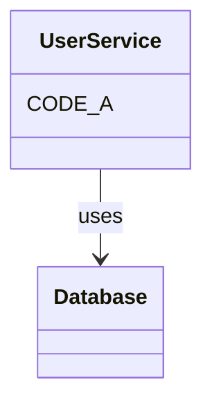

AICCL = AI Code Compression Language. Ultra-compressed code + visual architecture using your programming knowledge.

**Format**:
```xml
<comp:map>
M: = Model, F: = Function, {n,e,p#} = {name,email,password:hashed}
</comp:map>
<comp:code>
M:U{n,e,p#} F:gU(i)→db.f F:cU(d)→v→db.a
</comp:code>
```

**Mermaid Integration**: Diagram shows structure, AICCL codes specific logic

```xml
<comp:code id="CODE_A">
F:getUser(id)→db.users.find(id)
</comp:code>
```

**Symbols**: M/F/C=model/function/class, {}=fields, ()=params, →=flow, v=validate, db=database, q/s/d=query/save/delete, #=hashed, ?=optional

**Hierarchical Maps**:
```xml
<comp:map:1>
F: = function, CRUD = create/read/update/delete
</comp:map:1>
<comp:map:2 uses="1">
REST = RESTful API using CRUD
</comp:map:2>
```

Generate max compressed representations. Use mermaid for architecture, AICCL for implementation. Leverage your training knowledge of programming patterns.