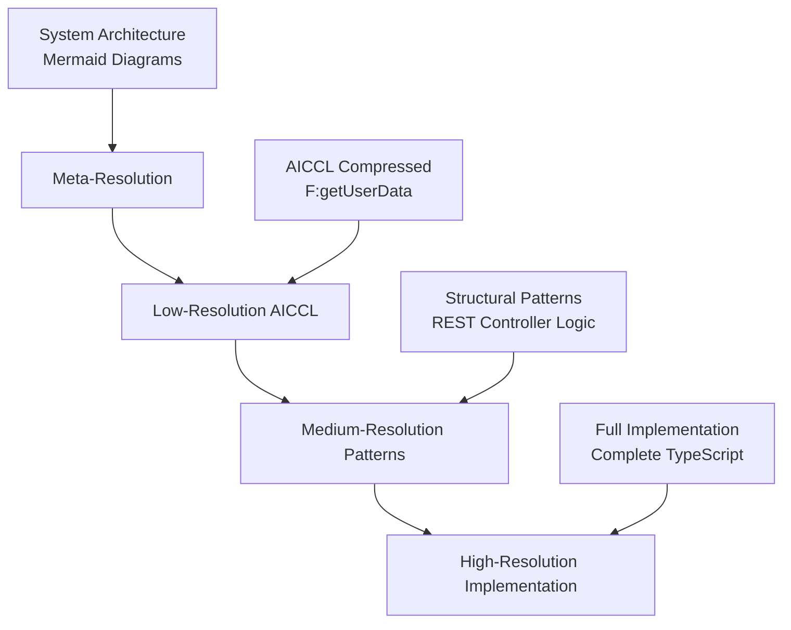
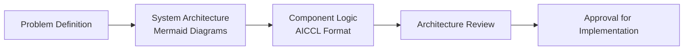
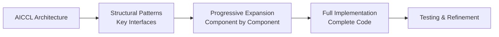
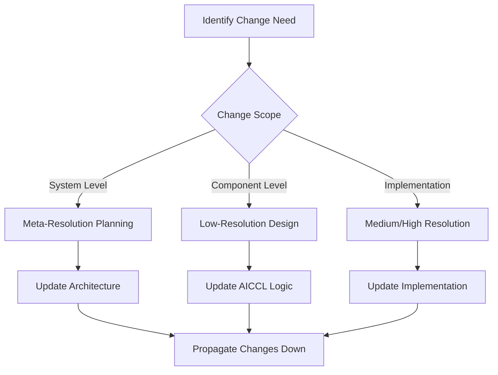

# Multi-Resolution Codebase Architecture

## Overview

The Multi-Resolution Codebase concept creates multiple abstraction layers of the same codebase, allowing developers and AI systems to operate at different levels of detail depending on the task. This approach dramatically improves context efficiency, architectural thinking, and system comprehension.

## Core Concept

Instead of viewing code at a single resolution (implementation details), we maintain **parallel representations** at different abstraction levels:

1. **High-Resolution**: Full implementation code (JavaScript, Python, etc.)
2. **Medium-Resolution**: Structural patterns and key logic flows  
3. **Low-Resolution**: AICCL compressed architectural representations
4. **Meta-Resolution**: System-level relationship diagrams

This creates a **zoom-capable codebase** where you can seamlessly move between architectural thinking and implementation details.

## The Resolution Pyramid



### Resolution Levels Explained

#### Meta-Resolution (System Level)
- **Purpose**: Overall system architecture and component relationships
- **Format**: Mermaid diagrams, system flow charts, service maps
- **Use Cases**: System design, architectural decisions, cross-team communication
- **Context Efficiency**: 100x compression - entire systems in single diagrams

#### Low-Resolution (AICCL Compressed)
- **Purpose**: Functional logic without implementation details
- **Format**: AICCL compressed code with semantic mappings
- **Use Cases**: Architectural planning, system refactoring, cross-component analysis
- **Context Efficiency**: 5-10x compression over full code

#### Medium-Resolution (Structural Patterns)
- **Purpose**: Key patterns, interfaces, and important implementation details
- **Format**: Simplified code showing structure with abbreviated implementations
- **Use Cases**: Code review, pattern analysis, API design
- **Context Efficiency**: 2-3x compression with structural clarity

#### High-Resolution (Full Implementation)
- **Purpose**: Complete executable code with all details
- **Format**: Full source code in target programming language
- **Use Cases**: Debugging, detailed implementation, testing
- **Context Efficiency**: No compression - full detail preservation

## Layered Development Workflow

### Phase 1: Architecture Design (Meta + Low Resolution)


**Benefits:**
- **5x larger effective context** for architectural thinking
- **Cross-system visibility** - see entire application architecture
- **Pattern consistency** across components
- **Rapid iteration** on system design

### Phase 2: Progressive Implementation (Medium + High Resolution)


**Benefits:**
- **Guided implementation** following architectural decisions
- **Consistent patterns** across codebase
- **Incremental complexity** management
- **Maintain architectural integrity** during implementation

### Phase 3: Maintenance & Refactoring (All Resolutions)


## Dual Index System Architecture

### Primary Index (Implementation)
```typescript
interface ImplementationIndex {
  files: Map<string, SourceFile>;
  components: Map<string, CodeComponent>;
  relationships: Map<string, ComponentRelationship>;
  embeddings: Map<string, number[]>;
}
```

### Shadow Index (AICCL Compressed)
```typescript
interface AICCLIndex {
  compressedFiles: Map<string, AICCLRepresentation>;
  architecturalPatterns: Map<string, PatternMapping>;
  systemFlows: Map<string, CompressedFlow>;
  compressionMappings: Map<string, CompressionScheme>;
}
```

### Resolution Bridge
```typescript
interface ResolutionBridge {
  expandToImplementation(aiccl: AICCLCode): Promise<SourceCode>;
  compressToAICCL(source: SourceCode): Promise<AICCLCode>;
  getPatternMapping(componentId: string): PatternMapping;
  updateAllResolutions(change: CodeChange): Promise<void>;
}
```

## Context Window Multiplication Effect

### Traditional Approach
```
200k token context window = ~50 files of detailed code
```

### Multi-Resolution Approach
```
200k token context window = 
  - 250+ files in AICCL format (5x compression)
  - 500+ components in pattern format (10x compression)  
  - Entire system architecture (100x compression)
```

### Practical Example
**E-commerce System:**
- **Traditional**: 10-15 components visible in context
- **Multi-Resolution**: Entire system (auth, catalog, cart, payment, shipping, analytics) visible simultaneously

## Implementation Strategy

### Phase 1: Dual Index Creation

#### Background AICCL Conversion
```typescript
class AICCLProcessor {
  async convertCodebase(projectPath: string): Promise<void> {
    const files = await this.scanCodebase(projectPath);
    
    for (const file of files) {
      // Convert to AICCL in background
      const aiccl = await this.convertToAICCL(file);
      
      // Store in shadow index
      await this.storeCompressed(file.path, aiccl);
      
      // Create resolution mappings
      await this.createMappings(file, aiccl);
    }
  }
  
  private async convertToAICCL(file: SourceFile): Promise<AICCLCode> {
    // Use specialized AICCL model or large model API
    const aiccl = await this.aiccLModel.compress(file.content, file.language);
    return this.validateCompression(aiccl, file.content);
  }
}
```

#### Resolution Synchronization
```typescript
class ResolutionSync {
  async updateFile(filePath: string, newContent: string): Promise<void> {
    // Update high-resolution (implementation)
    await this.implementationIndex.updateFile(filePath, newContent);
    
    // Update low-resolution (AICCL)
    const aiccl = await this.aiccLProcessor.convertToAICCL(newContent);
    await this.aiccLIndex.updateFile(filePath, aiccl);
    
    // Update affected architectural patterns
    await this.updatePatternMappings(filePath);
    
    // Propagate relationship changes
    await this.updateSystemRelationships(filePath);
  }
}
```

### Phase 2: Query Interface Enhancement

#### Multi-Resolution Queries
```typescript
interface MultiResolutionQuery {
  // Traditional implementation search
  searchImplementation(query: string): Promise<CodeComponent[]>;
  
  // AICCL architectural search  
  searchArchitecture(query: string): Promise<AICCLComponent[]>;
  
  // Pattern-based search
  searchPatterns(pattern: string): Promise<PatternMatch[]>;
  
  // Cross-resolution search
  searchAllResolutions(query: string): Promise<MultiResolutionResult>;
}

// Usage examples
const results = await multiResQuery.searchArchitecture("user authentication flow");
const patterns = await multiResQuery.searchPatterns("observer pattern implementation");
const comprehensive = await multiResQuery.searchAllResolutions("payment processing");
```

#### Context Generation by Resolution
```typescript
class ContextGenerator {
  async generateContext(query: string, targetTokens: number): Promise<string> {
    // Determine optimal resolution mix for token budget
    const resolutionMix = this.calculateOptimalMix(targetTokens);
    
    let context = "";
    let remainingTokens = targetTokens;
    
    // Add meta-resolution (system architecture)
    if (resolutionMix.includeMeta) {
      const systemDiagram = await this.getSystemDiagram(query);
      context += systemDiagram;
      remainingTokens -= this.estimateTokens(systemDiagram);
    }
    
    // Add low-resolution (AICCL) for broad context
    const aiccLComponents = await this.getRelevantAICCL(query, remainingTokens * 0.6);
    context += aiccLComponents;
    remainingTokens -= this.estimateTokens(aiccLComponents);
    
    // Add high-resolution for specific details
    const implementationDetails = await this.getImplementationDetails(query, remainingTokens);
    context += implementationDetails;
    
    return context;
  }
}
```

### Phase 3: Development Workflow Integration

#### IDE Integration Concept
```typescript
// VS Code extension or similar
class MultiResolutionIDE {
  // View switching
  switchToArchitecturalView(): void {
    this.showAICCLRepresentation(this.currentFile);
  }
  
  switchToImplementationView(): void {
    this.showFullImplementation(this.currentFile);
  }
  
  // Context-aware editing
  async editAtResolution(resolution: ResolutionLevel, changes: Edit[]): Promise<void> {
    if (resolution === ResolutionLevel.AICCL) {
      // Edit AICCL, then expand to implementation
      await this.editAICCL(changes);
      await this.expandToImplementation();
    } else {
      // Traditional editing with AICCL sync
      await this.editImplementation(changes);
      await this.syncToAICCL();
    }
  }
}
```

#### AI Assistant Integration
```typescript
class MultiResolutionAssistant {
  async planRefactoring(component: string): Promise<RefactoringPlan> {
    // Use AICCL for high-level planning
    const architecturalView = await this.getAICCLView(component);
    const plan = await this.ai.generateRefactoringPlan(architecturalView);
    
    // Validate against implementation details
    const implementation = await this.getImplementation(component);
    const validatedPlan = await this.validatePlan(plan, implementation);
    
    return validatedPlan;
  }
  
  async generateCode(requirements: string): Promise<GeneratedCode> {
    // Start with AICCL design
    const aiccLDesign = await this.ai.designInAICCL(requirements);
    
    // Expand to full implementation
    const implementation = await this.ai.expandAICCL(aiccLDesign);
    
    return {
      architecture: aiccLDesign,
      implementation: implementation,
      mappings: this.createMappings(aiccLDesign, implementation)
    };
  }
}
```

## Use Cases and Benefits

### Use Case 1: System Architecture Planning

#### Traditional Approach
```
Context Limitation: Can see 10-15 components simultaneously
Planning Scope: Single microservice or module
Architectural Consistency: Difficult to maintain across large systems
```

#### Multi-Resolution Approach
```
Context Expansion: Entire system (50+ components) visible in AICCL
Planning Scope: Complete system architecture and interactions
Architectural Consistency: Patterns enforced across all resolutions
```

**Example: E-commerce Platform Planning**
```xml
<comp:map>
  SVC = Service
  API = REST endpoint
  DB = Database
  MQ = Message Queue
  AUTH = Authentication
</comp:map>

<comp:mermaid>
graph TD
    AUTH:SVC --> API:users
    CATALOG:SVC --> API:products --> DB:products
    CART:SVC --> API:cart --> MQ:cart_events
    PAYMENT:SVC --> MQ:cart_events --> API:stripe
    SHIPPING:SVC --> MQ:payment_events --> API:logistics
</comp:mermaid>

<comp:code>
  SVC:AUTH{API:login(u,p){validate>jwt>return}}
  SVC:CATALOG{API:search(q){DB:products.find(q)>return}}
  SVC:CART{API:add(item){validate>DB:save>MQ:emit('item_added')}}
</comp:code>
```

### Use Case 2: Cross-System Refactoring

#### Problem: Change Authentication System
Traditional approach requires manually tracking all authentication touchpoints across the entire codebase.

#### Multi-Resolution Solution:
1. **AICCL Search**: Find all `AUTH` patterns across system
2. **Pattern Analysis**: Understand current authentication flow in compressed format
3. **Impact Assessment**: See all affected systems in architectural view
4. **Progressive Implementation**: Update AICCL first, then expand to code

### Use Case 3: Onboarding New Developers

#### Traditional Onboarding
- Read documentation (often outdated)
- Explore codebase file by file
- Try to understand system architecture from implementation details
- Takes weeks to understand complex systems

#### Multi-Resolution Onboarding
1. **Week 1**: Study system architecture (meta-resolution diagrams)
2. **Week 2**: Understand component logic (AICCL compressed patterns)
3. **Week 3**: Deep dive into implementation details (high-resolution code)
4. **Result**: Comprehensive system understanding in 3 weeks

### Use Case 4: AI-Assisted Development

#### Enhanced Context for AI
```
Traditional: "Here's the user service code (2000 tokens), please add email validation"

Multi-Resolution: "Here's the entire user management system architecture (500 tokens AICCL), 
the current user service patterns (300 tokens), and specific implementation details (1200 tokens). 
Please add email validation maintaining architectural consistency."
```

The AI gets:
- **System context**: How user service fits in overall architecture
- **Pattern context**: Existing validation patterns to follow
- **Implementation context**: Specific code to modify

## Technical Implementation Details

### Storage Architecture

#### File System Organization
```
project/
├── src/                          # High-resolution implementation
│   ├── components/
│   ├── services/
│   └── utils/
├── .felix/
│   ├── implementation.db         # Traditional code index
│   ├── aiccl.db                 # AICCL compressed index
│   ├── patterns.db              # Pattern mappings
│   └── resolutions.db           # Cross-resolution mappings
└── architecture/
    ├── system-diagrams/         # Meta-resolution diagrams
    ├── component-flows/         # Component interaction diagrams
    └── pattern-definitions/     # Reusable pattern definitions
```

#### Database Schema Extensions
```sql
-- AICCL Index Tables
CREATE TABLE aiccl_files (
    id TEXT PRIMARY KEY,
    file_path TEXT,
    original_hash TEXT,
    aiccl_content TEXT,
    compression_ratio REAL,
    pattern_mappings TEXT,
    created_at DATETIME,
    updated_at DATETIME
);

CREATE TABLE resolution_mappings (
    id TEXT PRIMARY KEY,
    implementation_id TEXT,
    aiccl_id TEXT,
    pattern_id TEXT,
    mapping_confidence REAL,
    sync_status TEXT
);

CREATE TABLE architectural_patterns (
    id TEXT PRIMARY KEY,
    pattern_name TEXT,
    aiccl_template TEXT,
    implementation_template TEXT,
    usage_count INTEGER,
    pattern_metadata TEXT
);
```

### Synchronization Strategy

#### Real-Time Sync
```typescript
class ResolutionSynchronizer {
  private syncQueue: SyncTask[] = [];
  
  async onFileChange(filePath: string, newContent: string): Promise<void> {
    // Queue sync task
    this.syncQueue.push({
      type: 'file_change',
      filePath,
      newContent,
      timestamp: Date.now()
    });
    
    // Process queue in background
    this.processSyncQueue();
  }
  
  private async processSyncQueue(): Promise<void> {
    while (this.syncQueue.length > 0) {
      const task = this.syncQueue.shift();
      
      try {
        // Update AICCL representation
        await this.updateAICCLRepresentation(task);
        
        // Update pattern mappings
        await this.updatePatternMappings(task);
        
        // Update system relationships
        await this.updateSystemRelationships(task);
        
      } catch (error) {
        console.error('Sync failed:', error);
        // Retry logic or manual intervention
      }
    }
  }
}
```

#### Conflict Resolution
```typescript
interface SyncConflict {
  filePath: string;
  implementationHash: string;
  aiccLHash: string;
  conflictType: 'structure' | 'logic' | 'pattern';
  resolutionStrategy: 'implementation_wins' | 'aiccl_wins' | 'manual_merge';
}

class ConflictResolver {
  async resolveConflict(conflict: SyncConflict): Promise<void> {
    switch (conflict.resolutionStrategy) {
      case 'implementation_wins':
        await this.regenerateAICCL(conflict.filePath);
        break;
      case 'aiccl_wins':
        await this.regenerateImplementation(conflict.filePath);
        break;
      case 'manual_merge':
        await this.requestManualIntervention(conflict);
        break;
    }
  }
}
```

## Performance Considerations

### Memory Usage
```
Traditional Index: ~100MB for large codebase
Multi-Resolution Index: ~150MB total
  - Implementation: 100MB
  - AICCL: 30MB (5x compression)
  - Patterns: 15MB
  - Mappings: 5MB
```

### Query Performance
```
Traditional Search: ~100-500ms for complex queries
Multi-Resolution Search:
  - AICCL only: ~50ms (smaller index)
  - Implementation only: ~100ms (unchanged)
  - Cross-resolution: ~200ms (combined search)
  - Pattern-based: ~30ms (highly optimized)
```

### Background Processing
```
AICCL Conversion: ~1-5 seconds per file
Pattern Detection: ~500ms per file
Sync Operations: ~100ms per change
Full Rebuild: 2-8 hours for large codebase (overnight process)
```

## Success Metrics

### Developer Productivity
- **Architecture Planning Time**: 50% reduction
- **Code Navigation Speed**: 3x faster for architectural tasks
- **Onboarding Time**: 60% reduction for new team members
- **Refactoring Confidence**: 80% increase in cross-system changes

### AI Assistant Effectiveness
- **Context Relevance**: 5x improvement in architectural context
- **Code Generation Quality**: 40% improvement in pattern consistency
- **System Understanding**: 10x more components visible in single context
- **Planning Accuracy**: 70% fewer architectural rework cycles

### System Maintenance
- **Documentation Sync**: Automatic maintenance of architectural documentation
- **Pattern Consistency**: 90% reduction in pattern violations
- **Technical Debt**: 50% faster identification and resolution
- **Knowledge Preservation**: Complete system understanding preserved across team changes

## Future Enhancements

### Advanced Resolution Types
1. **Temporal Resolution**: View code evolution over time
2. **Stakeholder Resolution**: Different views for different roles (architect, developer, QA)
3. **Domain Resolution**: Business logic vs technical infrastructure views
4. **Performance Resolution**: Optimization-focused code representations

### Integration Possibilities
1. **CI/CD Integration**: Automatic resolution updates on commits
2. **Code Review Enhancement**: Multi-resolution diff views
3. **Documentation Generation**: Automatic architectural documentation
4. **Metrics Dashboard**: Resolution-specific code quality metrics

### AI-Powered Enhancements
1. **Intelligent Resolution Selection**: AI chooses optimal resolution for tasks
2. **Pattern Discovery**: Automatic identification of new architectural patterns
3. **Architectural Drift Detection**: Monitor and alert on architectural inconsistencies
4. **Predictive Refactoring**: Suggest architectural improvements before problems arise

The Multi-Resolution Codebase transforms software development from **single-perspective implementation** into **multi-dimensional architectural thinking**, enabling unprecedented scale and sophistication in software system design and maintenance.