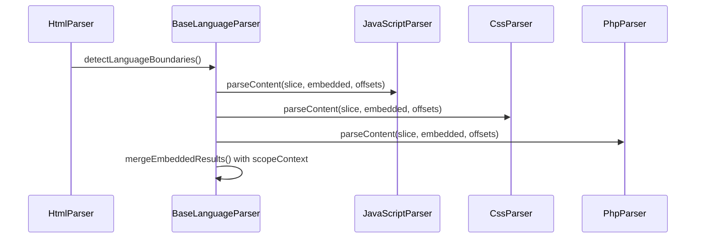

# Parser Stack Overhaul — Felix (formerly Felix)

> **Branding Note:** This document was written before the Felix rebrand. Any reference to “Felix” refers to Felix.

Status: Draft (proposed)  
Owners: felix maintainers  
Scope: `packages/code-intelligence/src/code-parser`, `apps/server`

## Goal

Support many more languages with robust, incremental, and semantically rich parsing while keeping our public model stable (`IComponent`, `IRelationship`, `ParseResult`). We introduce a layered parsing stack with clear fallbacks and capability flags, strengthen multi-language parsing (HTML⇄JS/CSS, PHP⇄HTML), and upgrade existing parsers to use proper AST/semantic paths.

## TL;DR Design

> **Update (Oct 2025):** The intermediate “language server” shim has been removed. The active stack today is AST (semantic) → Tree‑sitter (structural) → detector-based segmentation (basic). LSP adapters remain future work for editor integrations.

- Fallback chain per file: AST (semantic) → Tree‑sitter (structural) → detector-based segmentation (basic)
- Uniform output and capability flags: always return `IComponent[]`, `IRelationship[]` with metadata indicating `parsingLevel` and capabilities
- Keep `ParserFactory` as the router; add backend preference per language
- Use Tree‑sitter for breadth and incremental structure; use compiler/LSP for semantics where it matters (JS/TS, PHP, Python, Java; others opportunistic)

### Architecture (Mermaid)

```mermaid
flowchart TD
  PF[ParserFactory] -->|detect language| SEL[Backend Selector]
  SEL -->|AST/LSP available| SEM[Semantic Parser]
  SEL -->|else| TS[Tree-sitter Parser]
  SEM --> PR[ParseResult]
  TS  --> PR

  TS -.-> INJ[Injections (HTML to JS/CSS; PHP to HTML)]

  subgraph Semantics
    SEM --> RES[Resolver: Imports/Exports]
    SEM --> BND[Binder: Defs/Refs]
    SEM --> TYP[Types]
  end

  subgraph Structure
    TS --> QRY[.scm Queries]
    TS --> INC[Incremental Trees]
  end

  PR --> NORM[Relationship Normalizer]
  PR --> DB[(Storage)]
```

### Multi-language Embedding (Mermaid)



## Glossary

- AST (Abstract Syntax Tree): normalized syntax structure; often requires compiler frontends; can have binding/type info if paired with semantic passes
- CST (Concrete Syntax Tree): lossless parse tree (Tree‑sitter); great ranges; editor-grade; no binding/types by default
- LSP: Language Server Protocol; servers expose symbols, defs/refs, diagnostics, etc. (not a full AST API)

## Why Change (current gaps)

- JS/TS imports/exports not resolved to actual component IDs (only strings)
- Python relationship extraction partly regex-based; many UNRESOLVED targets
- PHP has nikic/php-parser, but we don’t run name resolution; some helpers fall back to regex
- HTML⇄embedded languages use regex boundaries; misses edge cases and isn’t incremental
- No capability flags; downstream can’t tell how “deep” results are

## Public Model (stable)

- Keep: `IComponent`, `IRelationship`, `ParseResult`
- Add (non-breaking): `ParseResult.metadata.parsingLevel?: 'semantic' | 'structural' | 'basic'`
- Add (non-breaking): `ParseResult.metadata.capabilities?: { incremental?: boolean; defsRefs?: boolean; types?: boolean; injections?: boolean; }`
- Optionally add to each `IComponent.metadata.parsingLevel?: string` for per-component provenance (same enum as above)

## ParserFactory Policy

- No new broker; keep `ParserFactory`
- Add per-language backend preference table (in code, not env) with order among: `ast`, `lsp`, `treesitter`, `detectors`
- Selection flow for `getParserForFile`:
  1) Pick a language via detection as today
  2) Try preferred backend → fallback to next until one is available
  3) Record chosen backend and set `parsingLevel`/capabilities in `ParseResult.metadata`

Example defaults

- JavaScript/TypeScript: `ast (TS Program + TypeChecker)` → `lsp (tsserver)` → `treesitter` → `detectors`
- Python: `ast (python ast + resolver)` → `lsp (pyright)` → `treesitter` → `detectors`
- PHP: `ast (nikic/php-parser + NameResolver)` → `lsp (intelephense)` → `treesitter` → `detectors`
- Java: `ast (JavaParser+SymbolSolver)` or `lsp (jdtls)` → `treesitter` → `detectors`
- Others (Ruby, Go, C#, Rust, Shell, SQL, YAML, TOML, Lua, …): `treesitter` → `lsp` (when trivial) → `detectors`

## Tiers in Detail

### Tier 1 — Detector Segmentation (baseline)

- Adapter: `BlockScanner` using TextMate scopes plus detector heuristics
- Inputs: TextMate grammars (`registry.json`) and YAML detector rules for fenced blocks, heredocs, templating, etc.
- Output: Segmented code blocks with language hints, confidence scores, and minimal metadata (`parsingLevel='basic'`)
- Use case: bootstrap segmentation for languages without structural parsers or when other backends fail; feeds later passes without external binaries

### Tier 2 — Tree‑sitter (structure + incremental)

- Base: `TreeSitterBaseParser` (extends `BaseLanguageParser`)
  - Engine: `web-tree-sitter` (WASM) for portability; grammar WASMs vendored under `resources/treesitter/<lang>.wasm`
  - Parse: maintain per-file `tree`; apply `tree.edit()` on changes; re-run `.scm` queries on affected subtrees
  - Queries: `queries/<lang>/{components,relationships}.scm`; standard captures `@name`, `@type`, `@declaration`, `@extends`, `@implements`, `@call.callee`, `@import.path`
  - Location: use node `startPosition/endPosition` for `Location`; extract source by byte ranges for `code`
  - Capabilities: `parsingLevel='structural'`, `capabilities.incremental=true`, `capabilities.injections=true` (when used)

- Injections (multi-language): prefer grammar injections over regex
  - HTML: inject JS/CSS/PHP within `<script>/<style>/<php>`; Vue SFC blocks (`<template>`, `<script setup lang=…>`, `<style scoped>`)
  - PHP: inject HTML between `<?php … ?>`
  - MDX/Markdown: optional injection for code fences and inline blocks

- First set of languages (low complexity, high value): HTML, CSS, JS/TS (structure), PHP (structure), Ruby, Go, C#, Rust, Shell, YAML, TOML, SQL, Lua

### Tier 3 — AST (semantic)

> LSP enrichment is deferred; these notes describe prospective work once true LSP integration returns.

- JavaScript/TypeScript (upgrade existing parser)
  - Build a `Program` and `TypeChecker` (tsconfig awareness, path aliases)
  - Build an `ExportIndex` per file; resolve `import`/`export` (including re-exports) → rewrite `IMPORTS_FROM` edges to concrete component IDs
  - Add file→file `DEPENDS_ON` edges
  - `parsingLevel='semantic'`, `capabilities={ defsRefs: true, types: true }`

- PHP (upgrade nikic path; remove regex fallbacks where possible)
  - Update `packages/code-intelligence/modules/code-parser/src/parsers/php/parser.php` to apply `NameResolver` and emit FQNs for all declarations and references; include `use` statements mapping
  - In `PhpParser.ts`, populate component IDs from FQNs; add `EXTENDS`, `IMPLEMENTS`, `USES (trait)` relationships with resolved targets; reduce regex-based helpers

- Python
  - Phase A: add a resolver to map `import x` / `from x import y` to files within workspace (relative and package layout); rewrite import edges to IDs when resolvable
  - Phase B: optional `pyright` LSP to obtain defs/refs/types; merge via offsets into our model
  - Keep `parsingLevel='semantic'` only when defs/refs are present; else `structural`

- Java
  - Option A: JavaParser + SymbolSolver to bind symbols (classpath aware)
  - Option B: JDT LS (LSP) when JDK present; richer project semantics
  - Map extends/implements/calls to resolved component IDs; record classpath diagnostics when unavailable

- Others (future): Go (`gopls`), C# (OmniSharp/csharp-language-server), Ruby (ruby-lsp), Rust (rust-analyzer), C/C++ (clangd)

## Multi‑Language Parsing

Current:

- Delegation across parsers via `LanguageBoundary`, slicing, offset merging (see `BaseLanguageParser.mergeEmbeddedResults`)

Overhaul:

- Phase 1 (quick): expand HTML boundary detection to handle `<script type="module">`, `lang="ts"/`scss``, Vue SFC, inline handlers, and resolve local `<script src>` resources; parse/link them and add `DEPENDS_ON`
- Phase 2 (robust): Tree‑sitter injections for HTML↔JS/CSS and PHP↔HTML; remove reconstruction hack paths; offsets come directly from CST node positions
- Optional semantics in embeddings: for embedded JS/TS, run TS checker on a virtual doc (slice + offset map) and resolve defs/refs back into the host file’s coordinate space

## API Changes (non-breaking)

TypeScript (proposed additions, optional fields):

```ts
// packages/code-intelligence/modules/code-parser/src/interfaces/ILanguageParser.ts
export interface ParseResult {
  // existing fields…
  metadata: {
    filePath: string;
    language: string;
    parseTime: number;
    componentCount: number;
    relationshipCount: number;
    // New (optional):
    parsingLevel?: 'semantic' | 'structural' | 'basic';
    capabilities?: {
      incremental?: boolean;
      defsRefs?: boolean;
      types?: boolean;
      injections?: boolean;
    };
    backend?: 'ast' | 'lsp' | 'treesitter' | 'detectors';
    [key: string]: any;
  };
}
```

ParserFactory (policy surface):

```ts
// Conceptual: not a breaking change
type Backend = 'ast' | 'lsp' | 'treesitter' | 'detectors';
type BackendPreference = Partial<Record<string /* language */, Backend[]>>;
// Default preferences defined in code; CLI can override per run if needed later
```

## Deliverables & File Map

Milestone 1 (Fix current pain)

- JS/TS: Import/export resolution with TypeChecker
  - Update: `packages/code-intelligence/modules/code-parser/src/parsers/JavaScriptParser.ts`
- PHP: NameResolver and FQNs
  - Update: `packages/code-intelligence/modules/code-parser/src/parsers/php/parser.php`
  - Update: `packages/code-intelligence/modules/code-parser/src/parsers/PhpParser.ts`
- Python: import resolver (relative + simple packages)
  - Update: `packages/code-intelligence/modules/code-parser/src/parsers/PythonParser.ts`
- HTML: better boundaries and `<script src>` local resolution
  - Update: `packages/code-intelligence/modules/code-parser/src/parsers/HtmlParser.ts`
- Add capability flags to `ParseResult.metadata` (optional fields only)
  - Update: `packages/code-intelligence/modules/code-parser/src/interfaces/ILanguageParser.ts`

Milestone 2 (Tree‑sitter breadth + incremental)

- New: `TreeSitterBaseParser` (WASM-based) and queries
  - Add: `packages/code-intelligence/modules/code-parser/src/parsers/tree-sitter/TreeSitterBaseParser.ts`
  - Add: `packages/code-intelligence/modules/code-parser/src/parsers/tree-sitter/queries/<lang>/*.scm`
- New parsers: HTML/CSS/JS (structure), Ruby, Go, C#, Rust, Shell, YAML, TOML, SQL, Lua
  - Add: `packages/code-intelligence/modules/code-parser/src/parsers/tree-sitter/<Lang>Parser.ts`
- ParserFactory hookup with backend preferences
  - Update: `packages/code-intelligence/modules/code-parser/src/ParserFactory.ts`

Milestone 3 (Optional LSP)

- (Future) Add `LspBackedLanguageParser` (stdio; per-language servers as available)
  - Add: `packages/code-intelligence/modules/code-parser/src/parsers/lsp/LspBackedLanguageParser.ts`
- Auto-detect servers on PATH; graceful fallback to Tree‑sitter/detectors

Milestone 4 (Java semantics)

- Choose JavaParser+SymbolSolver or JDT LS; implement bindings and resolved relationships
  - Update: `packages/code-intelligence/modules/code-parser/src/parsers/JavaParser.ts` (or LSP adapter)

## Tests & Acceptance

Unit/Integration (place under existing `__tests__` trees)

- JS/TS
  - Given A imports B (default, named, namespace, re‑exports), import edges are rewritten to B’s component IDs
  - Call graph within file and across files (basic case)
- PHP
  - FQNs attached to classes/interfaces/traits/functions/constants; extends/implements/trait relationships resolved to components
  - Namespaced imports via `use` are honored
- Python
  - Relative imports and `from x import y` resolved to local files; unresolved imports clearly flagged
- HTML/PHP/JS
  - Embedded blocks (script/style/php) produce components with correct absolute ranges
  - `<script src>` local paths are parsed and linked with `DEPENDS_ON`
- Tree‑sitter
  - Queries return expected components for sample files per language; incremental reparse updates only changed regions

Performance

- Measure parse time per backend and average per 1k LoC
- Ensure fallback doesn’t regress current throughput; cache results per file hash

## Rollout Plan (timeboxes, adjustable)

1) Week 1–2: Milestone 1 (JS/TS TypeChecker; PHP NameResolver; Python simple resolver; HTML boundary upgrades; capability flags)
2) Week 3–5: Milestone 2 (Tree‑sitter base + HTML/CSS/JS; add 3 long‑tail languages; incremental infra)
3) Week 6–7: Milestone 3 (Optional LSP: tsserver, pyright; simple server discovery; fallback wiring)
4) Week 8: Milestone 4 (Java semantics via chosen path)

## Risks & Mitigations

- Grammar management (Tree‑sitter WASMs): vendor known‑good versions; CI to verify load; no runtime network fetches
- Type explosion in metadata: keep new fields optional; default behavior unchanged
- LSP setup complexity: keep optional; auto-detect; silent fallback
- Mixed-language mapping errors: add mapping tests; prefer injections to regex boundaries

## Open Questions

- Which long‑tail languages to prioritize after HTML/CSS/JS? (suggest: Ruby, Go, C#, Rust)
- Do we want a CLI or config file to override backend preferences per run?
- How much of the JS/TS semantic pass should be on by default vs opt‑in (performance trade‑off)?

---

This spec aims to minimize churn: retain current ParserFactory and BaseLanguageParser while adding Tree‑sitter and LSP/AST backends as drop‑in adapters. We fix immediate semantic gaps first, then expand breadth with Tree‑sitter, and offer LSP for projects that can afford it.
