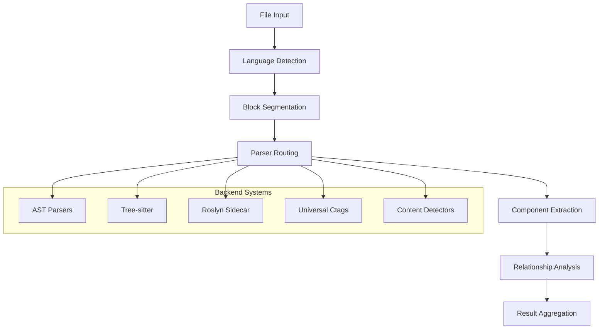
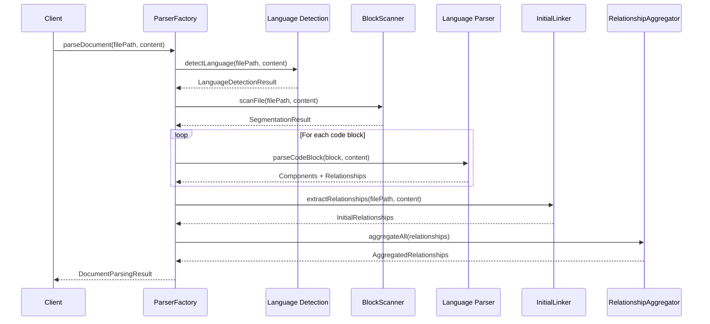
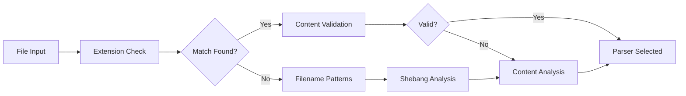

# Parser Stack Architecture

The Parser Stack represents a comprehensive code analysis framework designed to handle multiple programming languages, parsing backends, and mixed-language scenarios. This document provides a detailed overview of the architecture, design decisions, and component relationships.

## Table of Contents

1. [Overview](#overview)
2. [System Architecture](#system-architecture)
3. [Core Components](#core-components)
4. [Parsing Pipeline](#parsing-pipeline)
5. [Language Detection](#language-detection)
6. [Mixed-Language Support](#mixed-language-support)
7. [Backend Systems](#backend-systems)
8. [Performance Considerations](#performance-considerations)
9. [Design Decisions](#design-decisions)

## Overview

The Parser Stack is built around a modular, extensible architecture that supports:

- **Multi-language parsing**: JavaScript/TypeScript, Python, PHP, Java, HTML, CSS, Markdown, JSON, and more
- **Multiple parsing backends**: AST parsers, Tree-sitter, Roslyn sidecar for C#
- **Mixed-language files**: HTML with embedded JavaScript/CSS, PHP with HTML, Markdown with code blocks
- **Incremental parsing**: Efficient updates for large codebases
- **Segmentation-first approach**: Files are segmented into language blocks before detailed parsing



## System Architecture

### High-Level Components

The parser stack consists of several key layers:

1. **Factory Layer**: `ParserFactory` - Entry point and orchestration
2. **Detection Layer**: Language and content detection systems
3. **Segmentation Layer**: `BlockScanner` - File segmentation into language blocks
4. **Parser Layer**: Individual language parsers implementing `ILanguageParser`
5. **Service Layer**: Support services for linking, aggregation, and caching
6. **Interface Layer**: Standardized interfaces and type definitions

### Data Flow



## Core Components

### ParserFactory

The central orchestrator responsible for:

- **Parser Management**: Registration and lifecycle of language parsers
- **Language Detection**: Automatic detection using extensions, shebangs, and content analysis
- **Segmentation Coordination**: Managing the file-to-blocks pipeline
- **Result Aggregation**: Combining components and relationships from multiple sources
- **Backend Selection**: Choosing optimal parsing strategies

**Key Methods:**
- `parseDocument()`: Main entry point for comprehensive parsing
- `detectLanguage()`: Multi-strategy language detection
- `registerParser()`: Dynamic parser registration

### Language Parsers

Each language parser implements the `ILanguageParser` interface, providing:

#### Core Interface Methods
```typescript
interface ILanguageParser {
  readonly language: string;
  getSupportedExtensions(): string[];
  canParseFile(filePath: string): boolean;
  parseContent(content: string, filePath: string): Promise<ParseResult>;
  detectComponents(content: string, filePath: string): IComponent[];
  detectRelationships(components: IComponent[], content: string): IRelationship[];
  validateSyntax(content: string): ParseError[];
  validateContent(content: string): boolean;
}
```

#### Enhanced Extraction Interface
All parsers implement comprehensive extraction capabilities:

- **Module/Namespace Components**: Package and namespace declarations
- **Variable Components**: Declarations with scope and type inference
- **Constructor Components**: Class constructors and initialization
- **Accessor Components**: Getters, setters, and property accessors
- **Property Assignments**: Object and class property definitions
- **Framework Detection**: React components, Django models, etc.

### BlockScanner

Responsible for segmenting files into language-specific blocks:

**Segmentation Strategies:**
1. **Detector Segmentation**: Primary segmentation using TextMate scopes plus YAML detectors
2. **Content Detectors**: Pattern-based detection for embedded languages
3. **Hybrid Approach**: Combining both methods for optimal coverage

**Key Features:**
- Absolute line/byte positioning
- Confidence scoring for each block
- Metadata preservation (scope, kind, names)
- Support for complex nested structures

### Service Components

#### InitialLinker
Extracts file-level relationships:
- Import/export dependencies
- Module references
- Cross-file usage patterns

#### RelationshipAggregator
Consolidates relationships from multiple sources:
- Conflict resolution using confidence scores
- Duplicate relationship merging
- Multi-source relationship correlation

#### IncrementalParseCache
Optimizes repeated parsing operations:
- AST-level caching for unchanged files
- Incremental updates for modified content
- Memory-efficient cache management

## Parsing Pipeline

### 1. Language Detection

Multi-strategy approach with fallback mechanisms:



**Detection Methods (Priority Order):**
1. File extension with content validation
2. Filename patterns (package.json, Makefile, etc.)
3. Shebang line analysis
4. Content pattern matching

### 2. File Segmentation

Files are segmented into homogeneous language blocks:

```typescript
interface CodeBlock {
  language: string;
  startLine: number;
  endLine: number;
  confidence: number;
  source: 'detector' | 'merged' | 'textmate';
  metadata?: {
    kind?: string;
    name?: string;
    scope?: string;
  };
}
```

### 3. Block Parsing

Each block is routed to appropriate parsers:

- **Tree-sitter Parsers**: High-precision structural parsing
- **AST Parsers**: Semantic analysis with full language support
- **Roslyn Sidecar**: Advanced C# semantic analysis
- **Legacy Parsers**: Fallback regex-based parsing

### 4. Relationship Extraction

Multi-layered relationship discovery:

1. **Parser-level**: Language-specific relationships from AST
2. **Cross-file**: Import/export and module dependencies
3. **Aggregated**: Consolidated with confidence scoring

## Language Detection

### Extension-Based Detection

Primary detection method using file extensions:

```typescript
const extensionMap = new Map([
  ['.js', 'javascript'],
  ['.ts', 'typescript'],
  ['.py', 'python'],
  ['.php', 'php'],
  ['.html', 'html'],
  ['.css', 'css']
]);
```

### Content Validation

Each parser provides content validation:

```typescript
// JavaScript content patterns
const jsPatterns = [
  /\bfunction\s+\w+\s*\(/,
  /\bconst\s+\w+\s*=/,
  /\bclass\s+\w+/,
  /\bimport\s+.*\bfrom\b/,
  /=>\s*\{/
];
```

### Confidence Scoring

Detection results include confidence scores:

- **0.9+**: Extension match with content validation
- **0.8**: Filename pattern match
- **0.7**: Shebang detection
- **0.6**: Content pattern analysis

## Mixed-Language Support

### Delegation Chains

Parsers can delegate to other parsers for embedded content:

```typescript
// HTML parser delegates to JavaScript and CSS parsers
htmlParser.registerDelegate('javascript', jsParser);
htmlParser.registerDelegate('css', cssParser);
```

### Language Boundaries

Detection of language boundaries in mixed files:

```typescript
interface LanguageBoundary {
  language: string;
  startLine: number;
  endLine: number;
  scope: string; // e.g., 'text.html.php', 'source.js'
}
```

### Injection Handling

Tree-sitter parsers support language injections:

- HTML `<script>` tags → JavaScript parsing
- HTML `<style>` tags → CSS parsing
- Markdown code blocks → Language-specific parsing
- Vue Single File Components → Template/Script/Style parsing

## Backend Systems

### AST-Based Parsers

Language-specific parsers using native AST libraries:

**JavaScript/TypeScript:**
- Uses `@typescript-eslint/parser` or `babel-parser`
- Full semantic analysis
- Type information extraction
- Framework-specific component detection

**Python:**
- Uses Python `ast` module via subprocess
- Comprehensive symbol extraction
- Import resolution
- Class hierarchy analysis

### Tree-sitter Integration

High-performance incremental parsing:

**Capabilities:**
- Incremental updates
- Error recovery
- Language injections
- Syntax highlighting support

**Supported Languages:**
- JavaScript/TypeScript
- HTML with injections
- CSS with preprocessing
- More languages planned

### Roslyn Sidecar

Advanced C# semantic analysis using Microsoft Roslyn:

**Capabilities:**
- Full semantic analysis
- Type hierarchy extraction
- Control flow analysis
- Data flow analysis
- Symbol resolution

**Features:**
- JSON-RPC communication
- Cached compilation units
- Workspace-aware analysis
- MSBuild project support

### Universal Ctags

Fallback and segmentation support:

**Use Cases:**
- File segmentation
- Language detection
- Basic symbol extraction
- Unsupported language handling

## Performance Considerations

### Caching Strategy

Multi-level caching for optimal performance:

1. **File-level**: Cache parsed results for unchanged files
2. **AST-level**: Cache expensive parsing operations
3. **Incremental**: Update only changed portions

### Memory Management

Efficient memory usage patterns:

- Lazy loading of parsers
- Streaming processing for large files
- Garbage collection of unused caches
- Memory-mapped file access for huge codebases

### Parallel Processing

Concurrent parsing capabilities:

- Multi-threaded file processing
- Async parser operations
- Worker thread utilization
- Batch processing optimization

### Optimization Techniques

- **Early termination**: Stop parsing on confidence thresholds
- **Smart segmentation**: Skip non-code sections
- **Selective parsing**: Parse only requested components
- **Result streaming**: Progressive result delivery

## Design Decisions

### Segmentation-First Architecture

**Decision**: Segment files into language blocks before detailed parsing

**Rationale:**
- Enables mixed-language file support
- Allows optimal parser selection per block
- Improves error isolation
- Facilitates parallel processing

**Trade-offs:**
- Additional complexity in coordination
- Potential overhead for simple files
- More sophisticated error handling required

### Factory Pattern Implementation

**Decision**: Use factory pattern for parser management

**Rationale:**
- Centralized parser lifecycle management
- Dynamic parser registration
- Consistent interface across languages
- Simplified client interaction

**Benefits:**
- Extensibility for new languages
- Consistent API surface
- Configuration management
- Resource optimization

### Multi-Backend Support

**Decision**: Support multiple parsing backends simultaneously

**Rationale:**
- Different backends excel in different scenarios
- Graceful degradation when preferred backends unavailable
- Future-proofing for new parsing technologies
- Flexibility for different use cases

**Implementation:**
- Backend capability detection
- Automatic fallback chains
- Performance-based selection
- Configuration-driven preferences

### Interface Standardization

**Decision**: Standardize component and relationship interfaces

**Rationale:**
- Consistent output format across parsers
- Simplified downstream processing
- Type safety and validation
- Cross-language relationship modeling

**Key Interfaces:**
- `IComponent`: Universal component representation
- `IRelationship`: Standardized relationship format
- `ILanguageParser`: Parser contract definition
- `ParseResult`: Unified result structure

### Confidence-Based Aggregation

**Decision**: Use confidence scores for relationship aggregation

**Rationale:**
- Handle conflicting information from multiple sources
- Prioritize higher-quality parsing results
- Enable incremental quality improvements
- Support uncertainty in complex scenarios

**Implementation:**
- Source-specific confidence weighting
- Threshold-based filtering
- Conflict resolution algorithms
- Quality metrics tracking

This architecture provides a robust, extensible foundation for code analysis across multiple languages and parsing scenarios, with careful attention to performance, maintainability, and future evolution.
