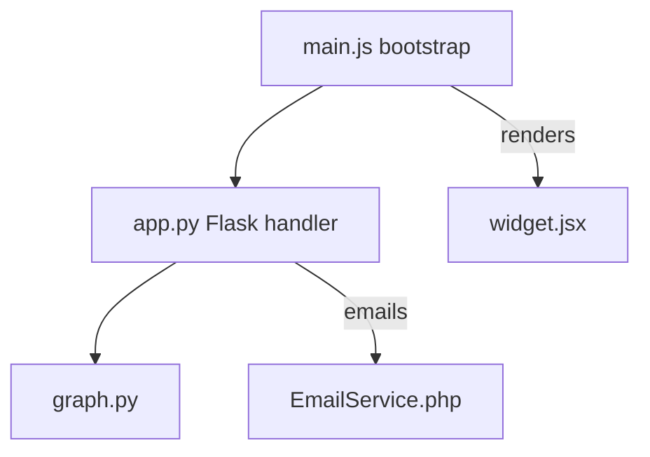

# Architecture Overview

Our visualization pipeline stitches multiple languages together. The Markdown parser should capture the index block below and produce documentation nodes that reference code, tasks, and rules.

[[INDEX:CONTEXT CL1]]

```index
# FILE_PATHS
F1:src/javascript/main.js
F2:src/javascript/component.ts
F3:src/javascript/widget.jsx
F4:src/python/app.py
F5:src/python/utils/graph.py
F6:src/php/index.php
F7:src/php/services/EmailService.php
F8:src/html/index.html
F9:src/css/styles.css
F10:src/sql/schema.sql
F11:src/json/config.json
F12:testdata/mixed.md

# SYSTEMS
S1:GraphVisualization|Interactive canvas rendering|
F1>1-120:Bootstraps the visualization pipeline
F3>1-120:GraphWidget renders React overlay
F9>1-120:Styles shared canvas elements

S2:IngestionPipeline|Parses upstream metrics and documents|
F4>1-160:Python API entrypoint
F5>1-200:Graph analyzer utilities
F7>1-200:Notification service for pipeline failures

# PIPELINE_FLOWS
PF1:RealTimeGraphFlow|F1>20-90>F4>30-150>F5>10-130>F3>40-110

# CODE_SNIPPETS
CS1:BootstrapEntrypoint|Primary JS init|
F1>1-40:@CODE@

CS2:HierarchyTraversal|Depth-first walk in Python|
F5>20-120:@CODE@

# DOCS_SECTIONS
DS1:VisualizationOverview|High-level explanation|
F12>1-40:@MARKDOWN@

# CONTEXT_LINKS
CL1:RealtimeGraph|End-to-end update path|
S1
PF1
CS1
CS2
DS1
```

The sections above should form a documentation tree. For example, `F1>20-90` references the JavaScript entrypoint. The Markdown parser must also pick up inline links like [EmailService](../src/php/services/EmailService.php) and code references `F4>32-54` within narrative text.

- JavaScript utility coverage: see `F1>1-120`, `F2>1-120`, and `F3>1-120` for imports, dynamic imports, generators, and decorators.
- Python async coverage: `F4>120-190` references the coroutine pipeline defined in `src/python/async_worker.py`.
- PHP interface coverage: `F7>1-200` and `F7>200-260` exercise traits, interfaces, and DateTime usage.
- SQL coverage: `F10>1-80` demonstrates tables, a view, and a trigger to validate relationship extraction.

- Embedded Task reference: [Task:task-fixture-001](../testdata/mixed.md#tasks)
- Embedded Rule reference: [Rule:rule-fixture-acceptance](../testdata/mixed.md#rules)

> When the system resolves relationships, the FILE_PATHS listing should map tokens like `F1` to full component IDs.



The mermaid block above should still create a Markdown code component even if rendering fails, enabling regression checks.
