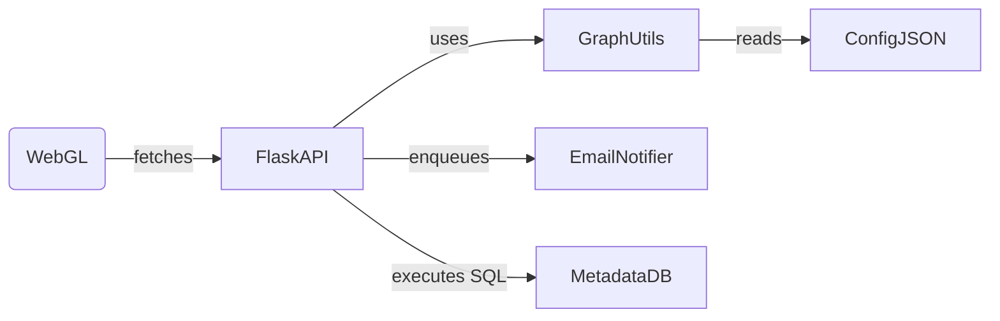

# Operations Runbook

This runbook documents how the ingestion service coordinates with the visualization runtime. It intentionally mixes normal Markdown, fenced code blocks, and inline component references.

## Incident Response Checklist

1. Hit the `/healthz` endpoint exposed in `src/python/app.py` to verify the Flask app is responding.
2. Tail the log aggregator via `python -m utils.graph tail` to ensure stream updates match the JavaScript feed.
3. If ingestion stalls, escalate to the EmailService notifier defined in `src/php/services/EmailService.php` implementing `NotifierInterface`.
4. Dispatch the async hydrator defined in `src/python/async_worker.py` when snapshot files need to be replayed.

### Linked Components

- `F4>80-110` (Python) orchestrates the graph rescore.
- `F1>60-95` (JavaScript) emits the updated payload to the React widget.
- `F7>30-100` (PHP) sends transactional emails.

### Mermaid Deployment View



### Embedded JSON

```json
{
  "alertChannels": ["slack", "email"],
  "sql": "SELECT id, status FROM ingestion_jobs WHERE status != 'ok'",
  "retry": {
    "maxAttempts": 3,
    "backoff": "exponential"
  }
}
```

### Cross-language Links

The Flask API calls `compute_layout` from `src/python/utils/graph.py`. That routine mirrors the TypeScript helper exported in `src/javascript/component.ts` so we expect cross-language relationships.

When Markdown is parsed, the inline references `[[INDEX:CONTEXT CL1]]` and `[[INDEX:FIND_REFS F1>20]]` should still resolve.
