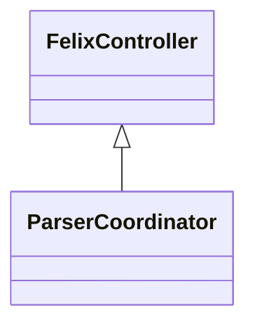

# Felix Overview

Welcome to the Felix knowledge base.

## Architecture

- C1: Core indexing pipeline
- C2: Semantic enrichment

### Pipeline Flow



> Felix makes it easy to understand large codebases.

### Documentation

Refer to [API reference](#api-reference) for usage.

```js example.js
function greet(name) {
  return `Hello ${name}`;
}
```

### Data Table

| Name  | Value |
|-------|-------|
| Alpha | 1     |
| Beta  | 2     |

```index
# FILE_PATHS
F1:apps/server/src/index.ts

# CONTEXT_LINKS
CL1:Task queue|Background job scheduling|
CL1>F1:42-48:@CODE@
```

## API Reference

Further details live in the docs.
